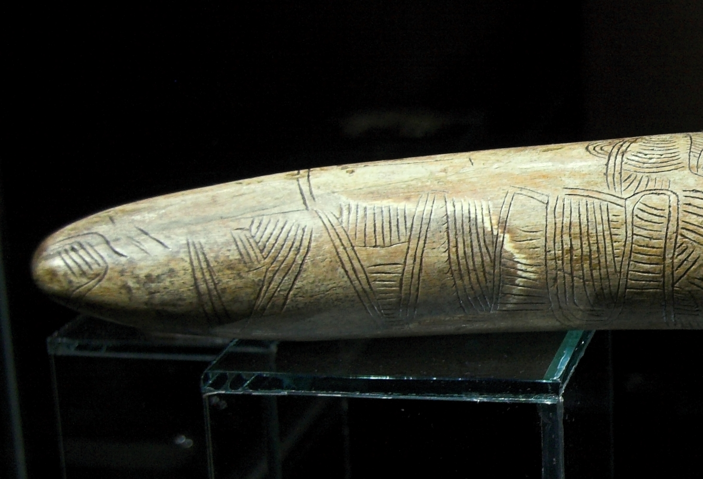
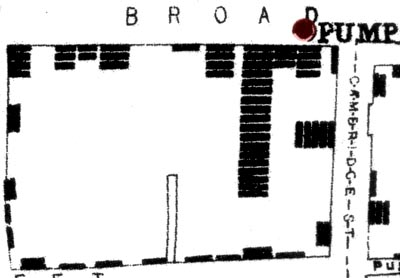
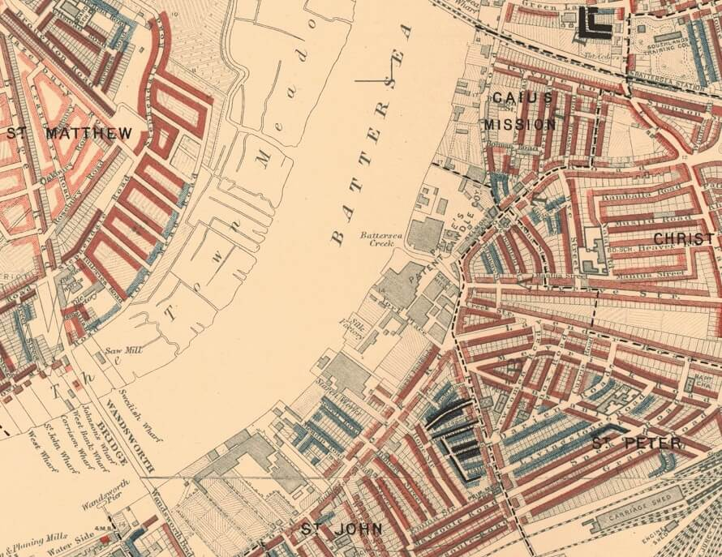
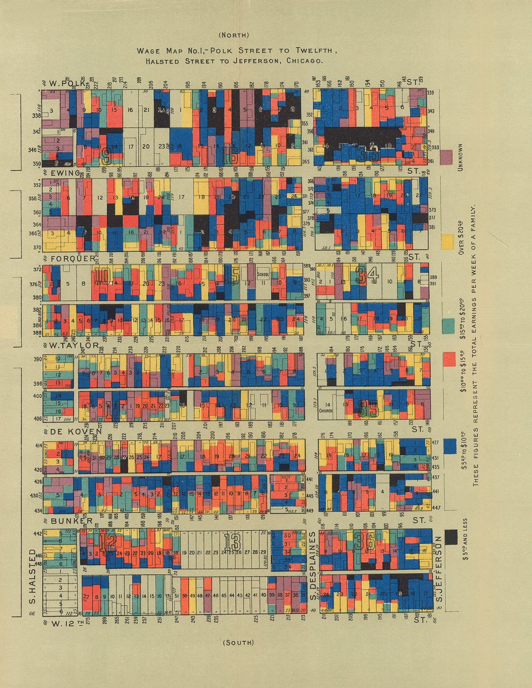
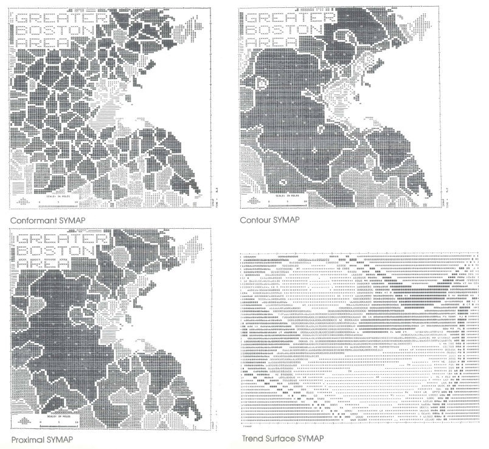
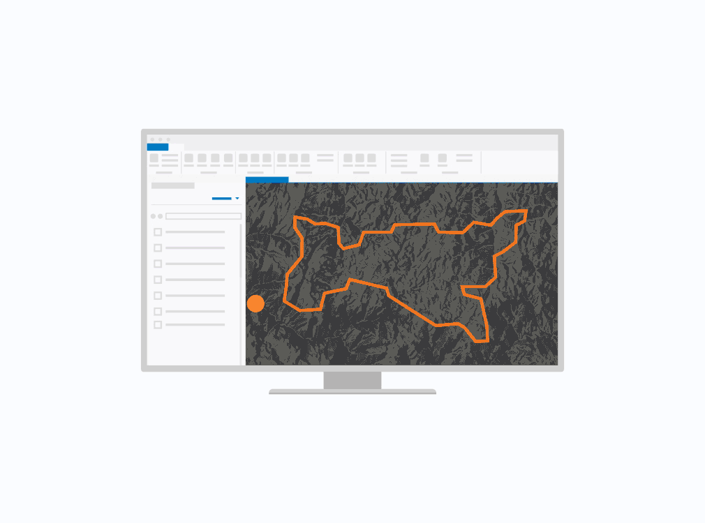
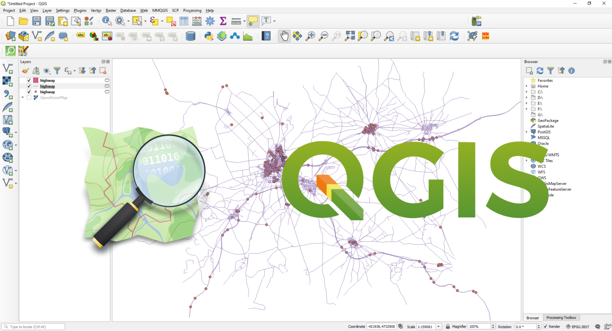
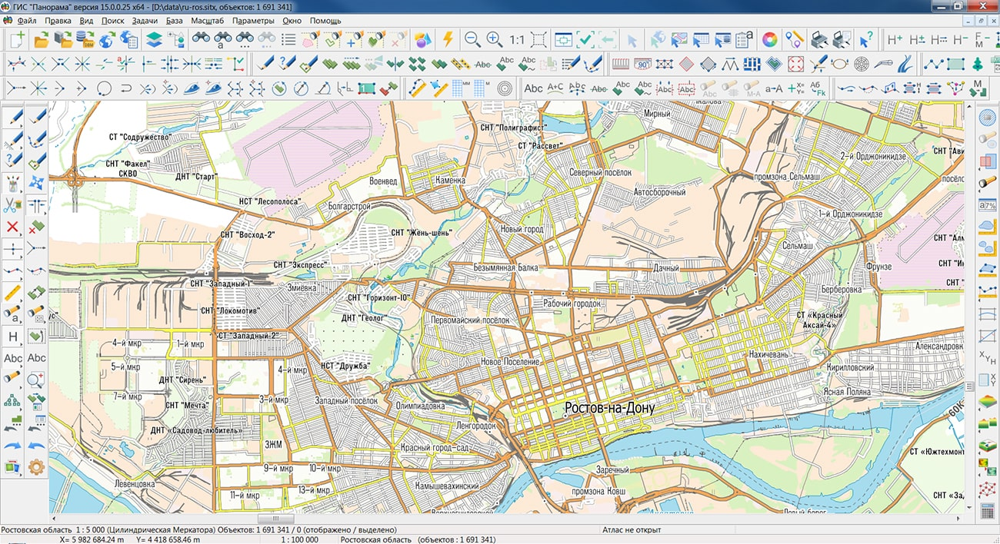
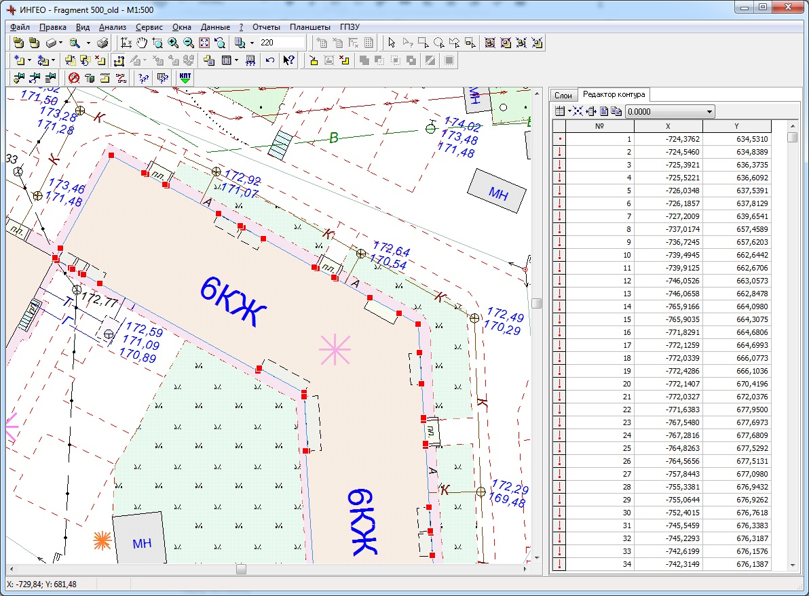

# История развития геоинформационных систем {#history}

**Геоинформатика** (GIScience, Geographical Information Science, Geoinformatics) -- наука, занимающаяся вопросами проектирования, создания, эксплуатации географических информационных систем (ГИС). Геоинформатика является одновременно научной дисциплиной и технологией.

> **ГИС** - это информационная система, обеспечивающая сбор, хранение, обработку, отображение и распространение пространственных данных.

> **«все где-то происходит»**, а ГИС позволяет нам визуализировать взаимосвязь между «что» и «где». Понимая эту взаимосвязь «что» и «где», мы можем решать свои профессиональные задачи, принимать решения и даже спасать жизни.

Так как ранняя история ГИС тесно связана с картографией, нельзя не упомянуть тот факт, что карты создавались на протяжении всей истории человечества с ранних времен.

Одним из первых применений карт для того, чтобы ответить на вопрос "что и где происходит" можно назвать **карту распространения холеры в Париже, подготовленную Шарлем Пике в 1834 году**[^01-intro-1]

[^01-intro-1]: Charles Picquet Maps One of the First Applications of Spatial Analysis in Epidemology <https://www.historyofinformation.com/detail.php?entryid=4237>

Наиболее известным же примером является **карта эпидемиолога Джона Сноу**, показывающая заболеваемость холерой в одном из районов Лондона.

Создание этой карты привело к научному прорыву как в области медицины и эпидемиологии, так и в области анализа данных (например, привело с созданию метода кластеризации).

Однако нельзя считать эту карту его заслугой[^01-intro-2] . На самом деле Сноу предположил, что холера распространяется через питьевую воду в 1849 году, то есть за 5 лет до эпидемии, преобладающей гипотезой в то время была теория миазмов. На основе своей гипотезы во время эпидемии 1854 года он, подкрепив свои данные официальной статистикой, обнаружил общий источник, и в сентябре 1854 года ручка насоса была убрана. А сама знаменитая карта была сделана и показана на встрече Эпидемиологического общества только в декабре 1854 года.

[^01-intro-2]: Something in the water: the mythology of Snow's map of cholera <https://www.esri.com/arcgis-blog/products/arcgis-pro/mapping/something-in-the-water-the-mythology-of-snows-map-of-cholera/>

Также отмечено, что он на самом деле не был первопроходцем тематического картографирования: подобные карты начали составлять примерно с конца 18 века и они были довольно распространены в 1830х годах.

.jpg)

Кроме того, Сноу сделал карту не сам, а она была подготовлена картографом [Чарльзом Шеффинсом](На%20самом%20деле%20Сноу%20предположил,%20что%20холера%20распространяется%20через%20питьевую%20воду%20в%201849%20году,%20то%20есть%20за%205%20лет%20до%20эпидемии,%20преобладающей%20гипотезой%20в%20то%20время%20была%20теория%20миазмов.%20На%20основе%20своей%20гипотезы%20во%20время%20эпидемии%201854%20года%20он,%20подкрепив%20свои%20данные%20официальной%20статистикой,%20обнаружил%20общий%20источник,%20и%20в%20сентябре%201854%20года%20ручка%20насоса%20была%20убрана.%20А%20сама%20знаменитая%20карта%20была%20сделана%20и%20показана%20на%20встрече%20Эпидемиологического%20общества%20только%20в%20декабре%201854%20года.%20Также%20отмечено,%20что%20он%20на%20самом%20деле%20не%20был%20первопроходцем%20тематического%20картографирования:%20подобные%20карты%20начали%20составлять%20примерно%20с%20конца%2018%20века%20и%20они%20были%20довольно%20распространены%20в%201830х%20годах.%20Кроме%20того,%20Сноу%20сделал%20карту%20не%20сам,%20а%20она%20была%20подготовлена%20картографом%20Чарльзом%20Шеффинсом%20https://en.wikipedia.org/wiki/Charles_Cheffins).

Карту Джона Сноу продолжают переосмыслять[^01-intro-3] и обсуждать[^01-intro-4] до сих пор.

[^01-intro-3]: <https://ralucanicola.github.io/cholera-map-3D/>

    <https://carto.maps.arcgis.com/apps/webappviewer3d/index.html?id=6292fde2362e44679d6359fb6d2bbefe>

[^01-intro-4]: **Essential, Illustrative, or ... Just Propaganda? Rethinking John Snow's Broad Street Map** Tom Koch and Ken Denike. Cartographica: The International Journal for Geographic Information and Geovisualization 2010 45:1, 19-31 <https://doi.org/10.3138/carto.45.1.19>

Чуть позднее картографические методы стали использоваться в том числе и в социальных исследованиях. Первым таким масштабным исследованием были **карты лондонской бедноты, подготовленные Чарльзом Бутом в рамках Исследования жизни и труда в Лондоне** (1886-1903 гг.) (Inquiry into Life and Labour in London). Это исследование было одним из больших исследований жизни рабочего класса того времени.

По результатам работы Чарльза Бута был подготовлен целый ряд карт, на которых выделялось 7 классов домохозйств в зависимости от уровня доходов и условий жизни.

Оригинальная карта лондонской бедности была подготовлена вместе с отчетом в 1889 году, а 10 лет спустя пересмотрена и обновлена в виде 12 листов карт более крупных масштабов.

Подробнее почитать про это исследование и ознакомиться подробными оцифрованными версиями карт можно [здесь](https://booth.lse.ac.uk/).

Позже последовали аналогичные исследования в других странах, например, **Hull House Maps and Papers**[^01-intro-5]**, подготовленные под руководством Флоренс Келли.** В рамках этого исследования были созданы карты заработной платы для одного из районов Чикаго.

[^01-intro-5]: <https://florencekelley.northwestern.edu/historical/hullhouse/>

Также следует упомянуть важное для социологии исследование **У. Э. Б. Дюбуа́ ([W. E. B. Du Bois](https://en.wikipedia.org/wiki/W._E._B._Du_Bois)) - The Seventh Ward of Philadelphia. Distribution of Negro inhabitants throughout the Ward and their social conditions**[^01-intro-6].

[^01-intro-6]: <https://en.wikipedia.org/wiki/The_Philadelphia_Negro>

> Более подробно с историей применения картографии в социальных исследованиях можно познакомиться в книге Vaughan, L. 2018. Mapping Society: The Spatial Dimensions of Social Cartography. London, UCL Press. <https://www.uclpress.co.uk/products/108702>

К **1950-м годам** карты начали использоваться для маршрутизации транспортных средств, планирования развития и определения местоположения достопримечательностей.

В период **с 1960 по 1975 год** три основных технологических достижения в области новых компьютерных технологий привели к рождению современных ГИС:

-   возможность вывода картографических изображений с помощью линейных принтеров; д

-   достижения в области хранения данных

-   увеличение вычислительной мощности мэйнфреймов.

Первые геоинформационные системы появились в 60-х годах прошлого века в Швеции и Канаде. Эти геоинформационные системы были узко специализированными и создавались для управления земельными ресурсами.

**Роджер Томлинсон** (17 ноября 1933 г. - 7 февраля 2014) - «отец ГИС», Канада, 1960-е, **Канадская географическая информационная система (CGIS)**. Фактически он был первым человеком, придумавшим термин "геоинформационная система".

CGIS была уникальна тем, что реализовала многоуровневый подход к работе с картой.

> *The early days of GIS were very lonely. No-one knew what it meant. My work has certainly been missionary work of the hardt kind*

Бюро переписи населения США также одним из первых приняло основные принципы ГИС. Бюро приступило к оцифровке границ переписи, дорог и городских территорий.

Ordnance Survey в Великобритании приступило к разработке своих топографических карт. Они использовали компьютеры для упрощения процесса обновления будущих изданий карт, а в 1971 году цифровое картографирование было введено в крупномасштабное производство карт ОС.

Swedish land databank system (SLDS), начало 70-х годов.

**1964 год**, [Говард Фишер](https://en.wikipedia.org/wiki/Howard_T._Fisher) (Howard Taylor Fisher), SYMAP (Synergetic mapping).

SYMAP была создана после ознакомления Фишера с цифровыми картами городского планирования, подготовленными группой **Эдгара Хорвуда ([Edgar Horwood](https://www.urisa.org/awards/edgar-horwood/)).** Фишерв [Фонд Форда](https://ru.wikipedia.org/wiki/%D0%A4%D0%BE%D0%BD%D0%B4_%D0%A4%D0%BE%D1%80%D0%B4%D0%B0) для того, чтобы продолжить работу над тематическим картографированием. В том числе на средства этого Фонда и была создана Гарвадская лаборатория компьютерной графики.

Следующий этап развития ГИС тесно связан с **Говардом Фишером** и основанной им в **1965 год Гарвардской лабораторией компьютерной графики и пространственного анализа ([Harvard Laboratory for Computer Graphics](https://en.wikipedia.org/wiki/Harvard_Laboratory_for_Computer_Graphics_and_Spatial_Analysis) and Spatial analysis).**

{width="400"}

В этой лаборатории и была создана первая векторная ГИС - **Odyssey.** Главной целью ее создания было спроектировать векторную ГИС, которая бы имела поддержку инструментов пространственного анализа.

Далее на основе **Odyssey** были созданы различные дополнения и расширения к основному функционалу.

В **1969** **Джек Дэнджермонд (Jack Dangermond)**, сотрудник Гарвадской лаборатории компьютерной графики, и его жена Лаура основали **Институт исследований экологических систем (Environmental Systems Research Institute), Inc. (Esri)**.

> I had some notion of applying computer mapping to my profession

В настоящее время ESRI около 40% рынка[^01-intro-7] геоинформационных систем.

[^01-intro-7]: Forbes profile. Jack Dangermond <https://www.forbes.com/profile/jack-dangermond/?sh=726658156c6e>

В период с **1990 по 2010 год** ГИС получили широкое распространение благодаря тому, что компьютеры становились дешевле, быстрее и мощнее, увеличивалось количество вариантов программного обеспечения ГИС, а оцифрованные картографические данные стали более доступны, а также благодаря тому, что были запущены новые спутники для наблюдений за Землей и появилась возможность использовать результаты дистанционного зондирования Земли в ГИС.

Современный нам этап развития геоинформационных систем можно охарактеризовать следующими тенденциями:

-   появление ГИС с открытым исходным кодом, в противовес коммерческим пропроетарным продуктам;

-   наличие общедоступной географической информации, в том числе благодаря краудсорсинговым проектам (OSM, Wikimapia);

-   проникновение ГИС в повседневную жизнь благодаря широкому распространению смартфонов и появлению приложений, использующих географическую информацию (навигационные приложения, сервисы доставки);

-   анализ больших данных;

-   использование методов ГИС в аналитике и программировании.

# Обзор современных ГИС {#overview}

## Зарубежные ГИС {#foreign}

В качестве самых распространенных в мире ГИС следует упомянуть ArcGIS, QGIS, [MapInfo](https://mapinfo.ru/node/211) и российскую разработку [ГИС Панорама](https://gisinfo.ru/).

[**ArcGIS**](https://www.esri.com/ru-ru/arcgis/products/arcgis-pro/overview) (ранее ArcView и ArcMap) - самая распространенная в мире коммерческая геоинформационная система. Разработчиком этой системы является компания ESRI - фактический монополист на рынке ГИС.

ArcGIS Pro, мощное однопользовательское настольное приложение ГИС, представляет собой многофункциональное программное обеспечение, разработанное с учетом усовершенствований и идей сообщества пользователей ArcGIS Pro. ArcGIS Pro поддерживает визуализацию данных; расширенный анализ; и авторитетное ведение данных в 2D, 3D и 4D. Оно поддерживает совместное использование данных в наборе продуктов ArcGIS, таких как ArcGIS Online и ArcGIS Enterprise, и позволяет пользователям работать на разных платформах через Веб-ГИС.

Своему широкому распространению эта система отчасти обязана тем, что компания-разработчик поставляла (и продолжает поставлять) систему на льготных условиях для учебных заведений, поэтому существует целое поколение специалистов, для которых она является основным ПО.

[**QGIS**](https://qgis.org/ru/site/) относится к бесплатному свободно распространяемому программному обеспечению, кроме просто работы в ней позволяет писать пользовательские модули и надстройки. Например, российская компания NextGIS разработала на базе QGIS свою систему с дополнительными функциями и технической поддержкой пользователей.

QGIS это дружественная к пользователю географическая информационная система (ГИС) с открыты кодом, распространяющаяся под GNU General Public License. QGIS является проектом Open Source Geospatial Foundation (OSGeo). Она работает на Linux, Unix, Mac OSX, Windows и Android, поддерживает множество векторных, растровых форматов, баз данных и обладает широкими возможностями.

{width="400"}

## Российские альтернативы {#russian}

В настоящее время существует рекомендательный справочный список Минстроя[^01-intro-8] по программному обеспечению из единого реестра российского программного обеспечения для субъектов градостроительной деятельности.

[^01-intro-8]: Перечень российского программного обеспечения для субъектов градостроительной деятельности в соответствии с данными единого реестра российского программного обеспечения для ЭВМ <https://minstroyrf.gov.ru/docs/143878/>

### ГИС Панорама

Сайт: <https://gisinfo.ru/products/products_panorama.htm>

Геоинформационная система, имеющая средства создания и редактирования электронных карт, выполнения различных измерений и расчетов, оверлейных операций, построения 3D моделей, обработки растровых данных, средства подготовки графических документов в электронном и печатном виде, а также инструментальные средства для работы с базами данных.

В состав ГИС входит более 100 различных задач, содержащих разнообразные инструменты для обработки пространственной информации о местности.

-   Гибкая система классификации пространственных данных, умные условные знаки;

-   Поддержка международных стандартов OGС, ISO 19100, IHO, ICAO и других по обмену и отображению пространственных данных;

-   Поддержка базы данных параметров национальных систем координат по коду EPSG;

-   Поддержка распространенных форматов обмена пространственными данными;

-   Совмещение данных из баз данных и данных из открытых источников по протоколам web-браузера;

-   Большой набор модулей расширения для специальных задач: кадастр земли и недвижимости, градостроительство, экология, управление агропредприятием, аэронавигация, управление сетями связи и другие;

-   Профессиональный редактор цифровых топографических, морских, аэронавигационных и других карт и планов городов;

-   Комплекс 3D анализа, Редактор отчетов, Конструктор форм, GPS\\ГЛОНАСС монитор и многие другие встроенные задачи;

-   Коллективная удаленная работа с данными, контроль доступа и защита данных на основе облачных технологий;

-   Формирование графических изображений, наглядно иллюстрирующих соотношение значений выбранной характеристики для отдельных объектов электронной карты;

-   Генерализация цифровых карт -- автоматизированное создание карт мелкого масштаба по крупномасштабным картам;

-   Подготовка цифровых карт к изданию;

-   Сбор данных для ведения кадастра земли и недвижимости;

-   Поддержка международных стандартов отображения и хранения морских (IHO) и аэронавигационных (ICAO) данных.

### ГИС Аксиома

Сайт: <https://axioma-gis.ru/>

**Создание и редактирование карт**

Инструментарий ГИС Аксиома позволяет эффективно работать с картографической информацией:

-   создавать и редактировать пространственные данные

-   настраивать оформление объектов и слоев

-   получать информацию по объектам карты

-   использовать различные системы координат и проекции

-   осуществлять поиск и выборку объектов

-   выполнять запросы и т.д.

**Совместимость с MapInfo**

Множество функций и инструментов ГИС Аксиома реализованы ***аналогично MapInfo Pro***, что обеспечивает легкий переход от MapInfo к Аксиоме, значительно снижая порог вхождения в новое ПО, при знании MapInfo. А совместимость форматов данных предоставляет вам возможность легко перенести ваши проекты из одной программы в другую.

-   ГИС Аксиома поддерживает TAB-файлы, созданные в MapInfo Pro.

-   Созданные тематические карты в MapInfo Professional и сохранённые в рабочем наборе (.MWS) будут доступны для работы в ГИС Аксиома.

-   Проекции, используемые в MapInfo Professional (.PRJ), полностью совместимы со средой ГИС Аксиома.

-   Простые SQL-запросы можно переносить из одной программы в другую с помощью QRY-файлов.

-   ГИС Аксиома поддерживает все стандартные стили оформления объектов MapInfo Pro.

**Данные в различных форматах**

ГИС Аксиома поддерживает **одновременную работу без конвертации** со всеми распространёнными форматами пространственных данных:

-   векторные данные в форматах ГИС MapInfo Pro, ESRI,  Панорама, AutoDesk, MicroStation, ERDAS и др.

-   аэрофотоснимки, спутниковые снимки, сканированные бумажные карты и т.д.

**Безопасность пространственных данных**

Для полноценной работы с ГИС Аксиома не требуется подключение к Интернету. Обмен информацией по сети Интернет возможен только по решению пользователя ГИС Аксиома. Пользователь определяет какие данные он хочет получить из Интернета, а также какие данные хочет передать по сети или выложить в Интернет.

**Настраиваемый интерфейс**

ГИС Аксиома использует два вида интерфейса и позволяет переключаться между ними:

-   Ленточный - основанный на панелях инструментов, разделенных вкладками

<!-- -->

-   "классический" - отображающий строку меню и прикрепляемые панели инструментов

**Оформление карт**

ГИС Аксиома имеет полный набор средств для оформления карт, включая библиотеки условных обозначений, принятые в Российской Федерации. Имеется редактор стилей линий и заливок площадных объектов.

**Тематическое картографирование**

Для наглядного представления пространственных данных в ГИС Аксиома используются различные методы построения тематических карт:

-   интервалы значений

-   столбчатые и круговые диаграммы

-   размерные знаки

-   отдельные значения

-   плотность точек

**Хранение и обработка данных в СУБД**

ГИС Аксиома работает с PostgreSQL, Microsoft SQL Server, Oracle, SQL Lite:

-   подключение к проекту таблицы БД

-   поиск и выборка объектов

-   работа с таблицами БД напрямую и через временные файлы

-   формирование SQL-запросов

-   создание тематических карт на основе данных БД

-   слияние таблиц по ключевому полю и т.д.

**Отчеты**

В ГИС Аксиома можно формировать отчеты и выводить их на печать.

В отчет можно включать любую необходимую информацию:

-   карты

-   таблицы

-   графики

-   тексты

-   условные обозначения

**Географический анализ**

Развитые инструменты географического анализа включают:

-   пространственные запросы

-   оверлейные операции

-   буферные зоны и др.

**Картографические WEB-сервисы**

ГИС Аксиома позволяет получить доступ к картографическим WEB-сервисам WMS, WFS и сервисам тайлов.

**Картографические проекции**

ГИС Аксиома работает с любыми картографическими проекциями.

В поставку ГИС Аксиома входит более 300 известных картографических проекций, включая российские СК-42, СК-95, ПЗ-90 и ГСК-2011. Также можно задавать собственные проекции.

В окне карты могут быть отображены слои в разных проекциях.

**Создание приложений**

Пользователи могут расширять функциональность системы и добавлять собственные модули в ГИС Аксиома. Для этого используется язык программирования Python. Справочная система содержит Руководство разработчика.

### ZuluGis

Сайт: <https://www.politerm.com/products/geo/zulugis/>

Документация <https://www.politerm.com/zuludoc/index.html>

Геоинформационная система ZuluGIS предназначена для разработки ГИС-приложений, требующих визуализации пространственных данных в векторном и растровом виде, анализа их топологии и их связи с семантическими базами данных.

Геоинформационная система ZuluGIS позволяет:

-   создавать всевозможные карты, включая схемы инженерных сетей

-   формировать собственную структуру данных, в частности, свои слои, условные обозначения, таблицы с атрибутами, справочники, шаблоны отчетов, средства визуализации и т.п.

-   использовать данные картографических веб-сервисов

-   работать с большим количеством растров

-   проводить совместный семантический и пространственный анализ графических и табличных данных

-   создавать различные тематические карты

-   осуществлять экспорт и импорт данных

-   готовить и публиковать данные для веб

Отличительной особенностью географической информационной системы ZuluGIS является то, что схемы инженерных сетей создаются с поддержкой их топологии, что позволяет использовать встроенные модули для выполнения гидравлических расчетов, построения пьезометрических графиков и продольных профилей.

Геоинформационная система ZuluGIS может быть представлена в виде полнофункционального рабочего места - однопользовательский режим или в качестве клиента для ZuluServer, сохраняя функционал настольного приложения - многопользовательский режим.

Судя по всему, главной особенностью ZuluGIS является поддрежка топологической структуры данных, что позволяет моделировать различные сети (например, сети инженерных коммуникаций или улично-дорожные сети) и решать задачи опираясь на топологию объектов.

### ГИС Ингео

Сайт <http://projects.integro.ru/%D0%B3%D0%B8%D1%81-%D0%B8%D0%BD%D0%B3%D0%B5%D0%BE/>

**1. Организация многопользовательского доступа и кроссплатформенность**

-   многопользовательский режим работы в архитектуре «клиент-сервер»;

-   работа с использованием сетевого протокола TCP/IP, для развертывания подсистемы ГИС в неоднородных сетях и в Интернет\\Интранет-сетях;

-   возможность запуска в среде ОС Windows и Linux (возможно, с использованием Wine).

**2. Интеграция с внешними источниками данных и системами**

-   техническая возможность подключения ГИС к открытым Web-сервисам --- Google Maps, Bing, 2GIS, Open Street Map, публичной кадастровой карте Россреестра, различным WMS-источникам. Список добавленных источников данных отображается в виде списка, в котором пользователь может включать/выключать видимость на экранах соответствующих источников. (Лицензионные вопросы с правообладателями интернет-ресурсов пользователь решает самостоятельно).

<!-- -->

-   открытый программный интерфейс (API) для расширения функций ГИС другими внешними программами;

-   возможность создание создания и подключения модулей расширения, как с помощью встроенных скриптовых языков программирования, таких как VBscript и Javascript, так и с помощью языков высокого уровня, таких как C++, C#, Delphi.

**3. Защита и контроль доступа в систему**

-   возможность настройки прав доступа к базе данных и проекту;

-   развитая система прав доступа пользователей к функциям просмотра и редактирования пространственных объектов на карте и семантических данных;

-   cоздание защищенной системы управления ГИС-ресурсами в организации.

**4. Визуализация карт на экране**

-   произвольное масштабирование карт с помощью «мыши»;

-   скроллинг растрово-векторного изображения карты внутри окна независимо от масштаба и по всей территории;

-   отслеживание координат мыши, селектируемой точки, длины линий, значений углов, длины периметра и площади полигона;

-   определение слоя, к которому принадлежит выбранный объект простым его выбором;

-   просмотр выбранной территории (включение/выключение слоёв [в т.ч. растровых], увеличение/уменьшение, панорамирование);

-   подключение и отображение внешних растровых источников в виде растровой подложки на карте, с возможностью вывода их на печать;

-   подключение к растровым источникам данных по протоколу WMS с возможностью выбора списка отображаемых слоев;

-   трансформирование пространственных данных от внешних источников за счет задания пользователем параметров отображаемой проекции, при помощи задания датума системы координат (определяемого в одном из форматов: WKT, Proj4, ESRI, EPSG);

-   задание набора опорных точек, позволяющих повысить точность наложения растровых данных на карту путем линейной трансформации растров. С возможностью интерактивного редактирования набора опорных точек.

**5. Создание и ведение цифровых карт и планов**

-   наличие развитых интерактивных средств редактирования информации (удаление границ, сдвиг вершин, удаление и добавление вершин, разбиение границ, сдвиг узлов, стягивание концов сегментов) с сохранением топологической корректности изображения на электронной карте;

<!-- -->

-   интерактивное создание структуры карт и слоев с библиотекой условных знаков;

-   установление межобъектных топологических отношений;

-   установление межслойных межобъектных топологических отношений;

-   ввод координат точек, отрезков, полилиний и полигональных областей с клавиатуры;

-   выполнение геометрических построений на цифровой карте;

-   трассировка контуров объекта по границам соседних уже отвекторизованных объектов с автоматическим установлением межобъектных топологических отношений;

-   ввод сопутствующей семантической информации непосредственно в процессе ввода картографической информации;

-   создание и использование произвольных векторных (масштабируемых и внемасштабных) символов. Повороты, масштабирование и растяжение символов;

-   управление гарнитурой и размерами шрифтов, цветными и штриховыми палетками при компоновке карт;

-   интерактивное конструирование пользователем произвольных типов линий и контуров полигональных объектов путём размножения вдоль линии произвольного графического символа;

-   «заливка» полигональных областей любым сконструированным пользователем символом;

-   «заливка» полигональной области прозрачной штриховкой;

-   возможность работы с полупрозрачными слоями (для растров и заливок векторных полигонов), что позволяет видеть объекты не только «над», но и «под» сплошной заливкой.

-   сервисные возможности (отображение вводимой информации на экране, увеличение-уменьшение изображения, удаление ошибочно введённых объектов, «откат» к предыдущим состояниям на произвольное число шагов и др.);

-   привязка (подравнивание) графических объектов к опорным объектам (точкам, полилиниям, полигонам);

-   возможность придания статуса «жёстких» или «гибких» объектов при операциях редактирования топологически связанных с ними объектов, что позволяет системе автоматически поддерживать корректную топологическую структуру при редактировании карты;

-   возможность ввода и редактирования координат с клавиатуры;

-   согласование содержимого семантических и картографических данных (подписи к объектам берутся из семантических таблиц и могут интерактивно модифицироваться с автоматической перерисовкой текста на карте);

-   возможность редактирования сопутствующей семантической информации в любое время работы пользователя (при санкционированном доступе);

-   использование для создания новых объектов и слоёв операций картографической алгебры (слияние, сложение полигонов, получение общих наложенных участков, умножение, вырезок и т.д.);

-   проведение необходимых измерений длин линейных и площадей полигональных объектов непосредственно на экране компьютера.

-   Оформление цифровых карт и планов в соответствии с Условными знаками для топографических планов масштабов 1:5000 1:2000 1:1000 1:500, Утвержденными ГУГК при Совете Министров СССР 25 ноября 1986 г.

(В частности, представление инженерных сетей в ГИС не допускается только лишь «проволочными моделями», вдоль линии, обозначающей инженерную сеть должны автоматически тиражироваться символы, обозначающие соответствующую инженерную сеть.).

**6. Ведение семантической информации по пространственным объектам**

-   взаимозависимость представлений данных в картографической, графической и табличных формах с автоматическим изменением их вида при внесении изменений в одну из них;

-   использование справочников при вводе кодовых показателей в поля семантических таблиц.

-   просмотр любой комбинации показателей по любой заданной таблице семантической базы данных (с возможностью сортировки выводимой информации по любому показателю);

-   вывод на принтер фрагментов цифровых карт;

-   использование в качестве полей семантических таблиц чисел, строк, даты, времени, изображения, справочников, документов в форматах внешних приложений (напр., Excel, Word, Visio и т.д.) и др.;

-   поиск в семантике и выдача характеристик произвольного объекта путём выбора его курсором на экране;

-   отображение информации по найденному объекту в унифицированном формате;

-   просмотр семантических данных, выбор интересующих записей и «подсветка» на экране объектов, соответствующих выбранным записям;

-   поиск по семантическим данным всех объектов, которые удовлетворяют формируемому в интерактивном режиме произвольному логическому условию;

-   отображение (подсветка) на экране объектов, попавших в обведённую на карте область, и выдача списка объектов, попавших в указанную область вместе с подробной информацией о них.

**7. Анализ картографической и семантической информации**

-   реализация полного набора операций пространственной (картографической) алгебры;

-   построение буферных зон вокруг объекта;

-   расчёт баланса площадей полигональных объектов (например, баланса земель) (можно получить суммарную площадь всех объектов зарегистрированных в карте слоёв, а также всех объектов выбранных слоёв) --- экспликацию земель.

**8. Вывод данных**

-   экспорт данных через буфер обмена Clipboard;

-   вывод информации по любому объекту из семантической базы данных в формате, удовлетворяющем требованиям пользователя (за счёт внешних приложений в среде Windows);

-   выбор одной или произвольной комбинации карт (слоёв) для последующего вывода;

-   вырезка из выбранной карты (или комбинации карт) произвольного фрагмента для формирования картосхемы;

-   возможность редактирования выходных документов в подсистеме «Макет печати» перед их выводом на печать;

-   вывод карт на любой принтер (ф.А4-А0, цветной или монохромный) любого произвольного фрагмента просматриваемой на экране карты. Система производит растеризацию векторного изображения карты перед печатью, что позволяет печатать карты большого формата на принтерах, плоттерах с относительно небольшой внутренней памятью;

-   оформление выводимой картосхемы (название, поясняющие тексты и т.п.) --- интерактивный генератор выходных печатных форм;

-   возможность задания поворота изображения перед выводом его на печать для более оптимального использования листа.

**9. Экспорт-Импорт цифровых карт из внешних обменных форматов**

-   импорт цифровых карт из форматов F20V, Shape, XLS, MIF/MID (MapInfo), DXF, TXT, PTS, SDR, XML, файлов Росреестра (КПТ, КВЗУ, КПЗУ);

-   экспорт цифровых карт в форматы DXF, MIF/MID (MapInfo);

-   импорт/импорт в/из обменного формата IDF (ИнГео), с сохранением (переносом) через формат топологических связей между пространственными объектами на картах;

-   открытый межпрограммный интерфейс (API) для написания конверторов сторонними разработчиками.

**10. Автоматизированный расчет длины смежеств земельного участка с протяженными объектами для метода моделирования на основе средневзвешенного значения удельного показателя кадастровой стоимости (УПКС) граничащих земельных участков.**

-   определение смежных земельных участков для выбранного земельного участка (ЗУ) и расчет протяженности смежных границ для каждого смежного участка;

-   массовый расчет смежных земельных участков для выбранного набора ЗУ на карте, либо по заданному списку кадастровых номеров;

-   отображение на карте в ГИС смежных земельных участков и смежных границ;

-   экспорт результатов расчета в буфер обмена и  в текстовый файл в формате csv.

**11. Автоматизированный расчет значений ценообразующих факторов для АИС «Государственная кадастровая оценка»**

-   расчет значений ценообразующих факторов (ЦОФ) с использованием расположения объектов недвижимости (ОН) на территории муниципального образования в доступных единицах измерения в зависимости от выбранного метода расчета -- в соответствии с Приказом Министерства экономического развития РФ от 12 мая 2017 г. № 226 «Об утверждении методических указаний о государственной кадастровой оценке» (С изменениями и дополнениями от: 9 августа 2018 г., 9 сентября 2019 г.);

-   поддержка следующих методов расчета: «расстояние до центра ближайшего», «расстояние до ближайшего», «процент покрытия», «количество объектов», «попадание объекта в зону», «расчет коэффициента протяженности»;

-   отображение на карте в интерактивном режиме результатов расчета ЦОФ;

-   отображение на карте в ГИС результатов расчета формул в виде тематических карт;

-   сохранение результатов расчета в текстовом файле формата .csv;

-   экспорт результатов расчета в систему АИС «Государственная кадастровая оценка».

**12. Подсистема «Территориальное планирование»**

-   система картографических слоев, семантических таблиц пространственных объектов, а также стилевое оформление объектов встроены в ГИС и выполняются в соответствии с классификатором пространственных объектов, приведенным в **Приказе Министерства экономического развития РФ от 9 января 2018г. № 10** «Об утверждении Требований к описанию и отображению в документах территориального планирования объектов федерального значения, объектов регионального значения, объектов местного значения и о признании утратившим силу приказа Минэкономразвития России от 7 декабря 2016 г. № 793».

### ГИС Терра

Сайт <https://www.gisterra.ru/index.php>

**ГИС "Терра"** Для решения широкого спектра картографических задач, включающих работу с векторными пространственными данными и растровыми подложками

-   полное соответствие требованиям Приказа Минэкономразвития РФ от 09.01.2018г. № 10 (в том числе импорт/экспорт формата GML, актуальные условные обозначения, проверка топологии на ошибки)

-   многопользовательская работа с данными. Позволяет нескольким пользователям ГИС одновременно вносить изменения в одни и те же редактируемые слои карт. Не требуется отдельного сервера и какого-либо дополнительного программного обеспечения)

-   хранение всей истории изменения объектов с указанием даты изменения, идентификатора программы и пользователя, внесшего изменения, а также возможностью вернуть объект в любое из предыдущих состояний (максимально допустимый объем сохраняемой истории ограничен только свободным местом на жестком диске компьютера)

-   поддержка основного функционала базы данных, включая выборку и обновление сведений посредством структурированного языка запросов (SQL)

-   широкие возможности по графическому оформлению карт (как стандартные, встроенные в ГИС, так и добавляемые пользователем стили и условные знаки)

-   поддержка различных координатных систем

-   неограниченный объем атрибутивной информации объектов (строки переменной длины, двоичные данные произвольного объема)

-   инструмент трансформации растров

-   инструмент создания пирамидального растрового слоя

**Терра.Топография.** Для создания цифровых топографических планов в масштабах 1:5000, 1:2000, 1:1000, 1:500, 1:200

-   построение цифровой модели ситуации и рельефа

-   импорт точек из внешних файлов

-   пересчёт

-   построение продольного и поперечного профилей по трассе

-   вычисление объемов и построение картограммы земляных масс

-   подготовка к печати: автоматическое создание плана или его части с зарамочным оформлением

-   экспорт цифровой модели местности в формат DWG

**Терра.Вычисления.** Для автоматизированной обработки геодезических измерений, включая импорт, уравнительные вычисления и формирование отчетных документов

-   импорт измерений из внешних файлов

-   ручной ввод и редактирование данных тахеометрии, теодолитных и нивелирных ходов

-   строгое уравнивание плановых и высотных сетей классическим коррелатным способом по методу наименьших квадратов с оценкой точности

-   автоматическое формирование отчетных ведомостей

-   создание отчетной схемы обоснования и границ работ с возможностью печати

### UrbanCS[^01-intro-9]

[^01-intro-9]: Судя по отсутствию обновлений на сайте, программа более не поддерживается.

Сайт: <http://www.urbanics.ru/products/detail.php?ID=1192>

Программный продукт UrbaniCS реализует технологическую основу для создания комплексных кадастровых, муниципальных, а также региональных информационных систем организации градостроительной деятельности (ИС ОГД), в том числе:

-   ведения баз данных всех типов;

-   электронных карт;

-   статистической и аналитической обработки по экономическим, инфраструктурным, социальным, экологическим характеристикам территорий любого порядка;

-   поддержки принятия решений в области градостроительной деятельности и территориального управления.

Основные возможности UrbaniCS:

-   Поддержка электронного документооборота, включающая прием, обработку и контроль выполнения документов (заявок), в том числе назначение видов работ по отделам и исполнителям, связь объектов, документов, карт.

-   Многопользовательская работа с электронными картами и атрибутивными данными в режиме «реального времени» с разграничением полномочий (прав) пользователей путем назначения ролей и рабочих групп.

-   Мониторинг информационных картографических слоев карт и паспортизация объектов градостроительной деятельности: объекты капитального строительства, земельные участки, отводы, функциональные и иные зоны, градостроительные регламенты, инженерные сооружения и коммуникации, в том числе объектов, не отображаемых на цифровых картах.

-   Ведение тематических реестров: адресного, объектов капитального строительства и градостроительных документов и других.

-   Ведение единой картографической основы, включающей адресный и дежурный план, схемы территориального планирования, планировки, зонирования, регламентов, темати­ческие карты, предназначенные для многопользовательского доступа.

-   Работа с функциональными зонами

-   Актуализация электронных карт в соответствии с результатами исполнительных съемок, топографических, геодезических и иных видов работ.

-   Мгновенная подготовка справочной, статистической, аналитической информации (по шаблонам документов и произвольно) по любым иерархически связанным объектам и их характеристикам за счет гибкого и интуитивно понятного интерфейса анализа методом «drag-and-drop».

-   Ведение широкого спектра отраслевых (ведомственных) справочников, уникальных для различных видов объектов и документов, используемых для ввода их описательных характеристик и реквизитов.

-   Работа с разделами ИС ОГД

-   Подготовка стандартных отчетных форм по заданным шаблонам (например, градост­ро­ительных документов, в том числе градостроительных планов, актов выбора земельных участков) в стандартизованном оформлении, с использованием принятых условных знаков и печать по заранее заданным шаблонам с помощью встроенного модуля отчетов.

-   Публикация электронных карт, схем, описательных и иных открытых данных в сетях интранет и интернет. Информационный обмен с любыми системами, в том числе, импорт/экспорт в распространенные форматы ГИС (MapInfo, ArcView).
