---
---
---

# Начало работы {#basics}

## Добавление объектов на карту {#add-object}

В качестве первой работы построим и оформим карту супермаркетов в городе Санкт-Петербург.

Исходные данные для работы можно скачать по ссылке [здесь](https://drive.google.com/file/d/1LTFghQlrXeFDh5BI-hiZRBPbr6rzc7uw/view?usp=sharing)

Исходные данные были взяты с OpenStreetMap и сохранены в виде таблицы со следующими столбцами:

-   brand - название сети супермакетов;

-   lat - широта, градусы;

-   lon - долгота, градусы.

Для начала работы нужно запустить программу QGIS. После первого запуска вы увидите графический пользовательский интерфейс.

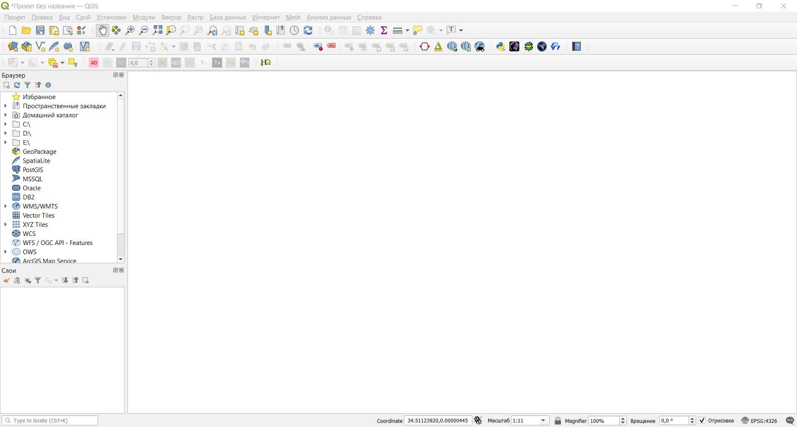

В верхней части окна расположена строка меню и панель инструментов, в левой части сверху окно Браузер, в котором отображаются все доступные источники данных для работы, в левой нижней части окно Слои, где будут отображаться слои, загруженные в проект.

> Проект - совокупность всех слоев, стилей, макетов и прочего. Проекты позволяют сохранить конкретный сеанс работы.

Для того, чтобы добавить данные на карту воспользуемся строкой меню: **Слой --- Добавить слой --- Добавить слой из текста с разделителями.**

После этого в диалоговом окне нужно задать параметры добавления объектов: имя слоя, вид разделителя, названия атрибутов, координаты точек, систему координат и прочее.

В нашем случае в качестве координат точек выступают колонки *lat, lon*, а система координат необходима `EPSG:4326 - WGS 84` (про системы координат в ГИС есть отдельный раздел \@ref(crs)).

После добавления на карте должны появиться точки объектов

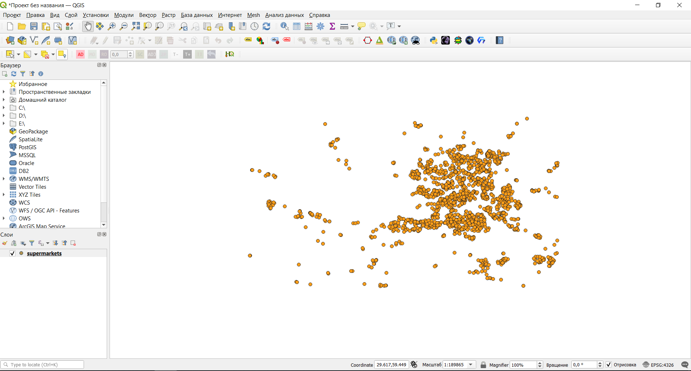

## Добавление подложки {#tiles}

Для более понятной карты добавим на карту подложку OpenStreetMap. Это можно сделать двумя способами: через панель *Браузер* и с помощью плагина *QuickMapServices*.

Для того, чтобы добавить подложку из панели Браузер достаточно просто найти в ней `XYZTiles`, щелкнуть два раза, после чего раскроется список доступных тайлов (по умолчанию доступны только стандартные тайлы OpenStreetMap).

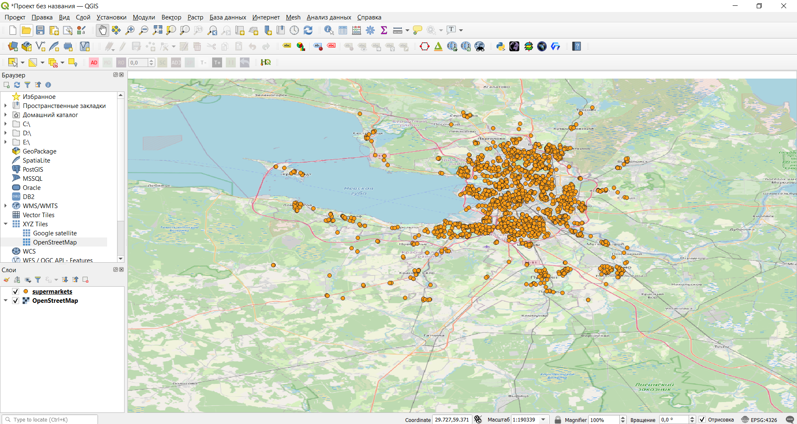

> **Тайлы или тайловые карты** - это карта, отображаемая в веб-браузере путем бесшовного соединения десятков индивидуально запрашиваемых файлов изображений или векторных данных.
>
> Google Maps был одним из первых крупных картографических сайтов, использовавших эту технику. В первых плиточных веб-картах использовались растровые плитки, до появления векторных плиток.

Возможно нужно будет перетащить в перечне слоев подложку под слой с супермаркетами, чтобы она не перекрывала наши точки.

> По умолчанию слои отрисовываются в том порядке, в котором они расположены в перечне слоев. То есть слои, находящиеся в списке выше, будут отображаться поверх других слоев

Чтобы добавить подложку через плагин QuickMapServices нужно сначала его установить. Установка плагинов осуществляется через строку меню: **Модули --- Управление и установка модулей**.

В открывшемся окне через строку поиска нужно будет найти модуль по его названию и установить.

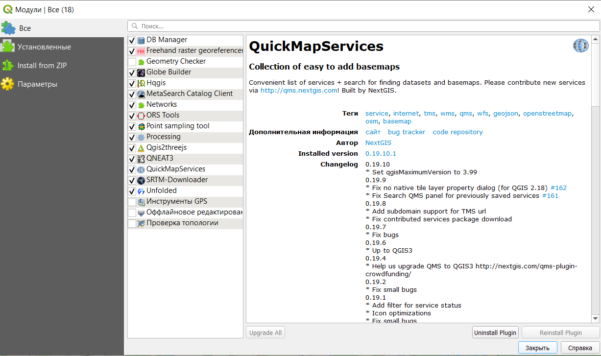

После установки на панели инструментов появятся 3 значка 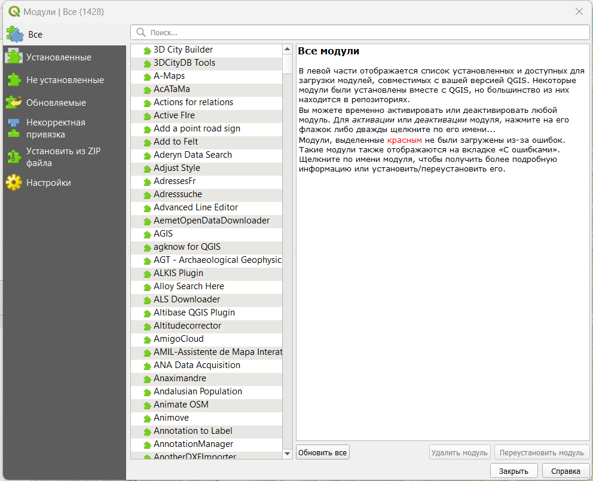{width="99"}.

Далее можно добавить стандартную подложку OpenStreetMap

Установленный плагин позволяет добавлять не только стандартную подложку OSM, но и целый ряд других.

## Настройка карты {#reproject-fly}

Глядя на нашу карту, мы заметим, что изображение выглядит непривычным для нас, как бы наклоненным. Это объясняется немного непривычной системой координат, в которой у нас создан проект и слой. Для изменения отображения карты, мы можем выполнить "перепроецирование на лету".

Для того, чтобы это сделать, необходимо в правом нижнем углу окна программы найти кнопку 

После ее нажатия открывается диалоговое окно с настройками системы координат

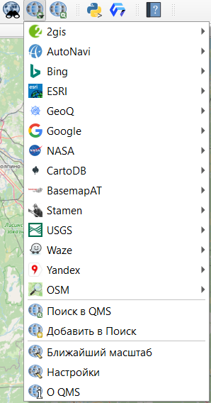

Для того, чтобы сделать карту более привычной нам на вид выберем систему координат `EPSG:3857 - WGS 84 / Pseudo Mercator`. После изменения системы координат изображение должно "выровняться".

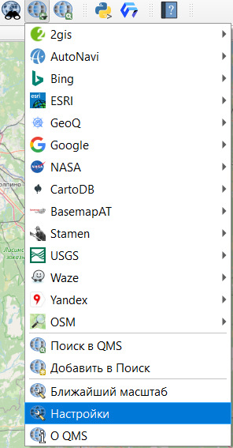

> Важно помнить, что перепроецировании на лету не изменяются системы координат слоев, меняется только их отображение на экране.

### Настройка стиля {#style-basics}

Настроим стиль слоя. Для этого нужно открыть окно настроек либо двойным кликом левой кнопки мыши по названию слоя, либо в контекстном меню (открывается кликом правой кнопки мыши по названию слоя) *Свойства*.

При добавлении объектов они обозначаются простыми символами (*Обычный знак*), но возможен выбор других вариантов отображения объектов.

-   уникальные значения - как правило, используется для категориальной или дискретной переменной с небольшим количеством значений;

-   градуированный знак - для задания символа в зависимости от числовой переменной, также позволяет использовать выражения;

-   правила - позволяет задавать символику на основе выражения;

-   смещение точек - позволяет показать все точки слоя, даже если они находятся в одном месте, возможны варианты смещения по кругу, концетрическим кругам и сетке;

-   point cluster - собирает близко расположенные точечные объекты в один;

-   создание теплокарт - создает динамическую карту плотности распределения объектов.

Для линейных и площадных объектов будут немного другие варианты, которые будут рассмотрены далее в курсе.

#### Простые символы

В нашем датасете есть фактически всего один атрибут, по которому мы можем настроить стиль символов - *brand*. Так как это категориальная переменная, следует использовать тип символа **Уникальные значения**. После выбора типа символа нужно выбрать **Значение** (атрибут, по которому будет задаваться символ) и нажать кнопку **Классифицировать**. После этого будет осуществлена автоматическая классификация по заданному атрибуту и отобразиться легенда слоя.

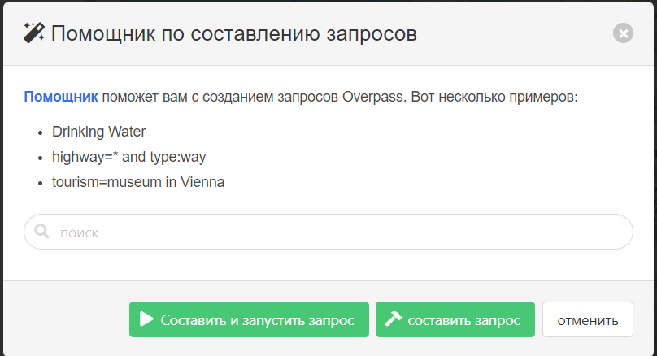

При необходимости далее можно

-  выбрать нужную палитру или создать свою

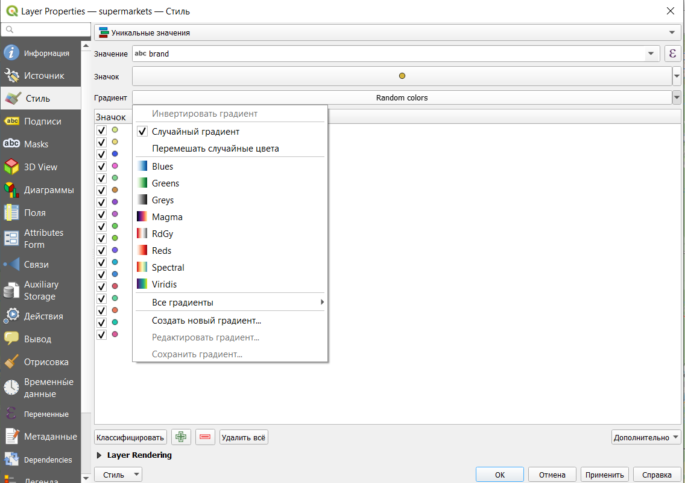

-   настроить символ - выбрать его размер, прозрачность, вращение, вид символа

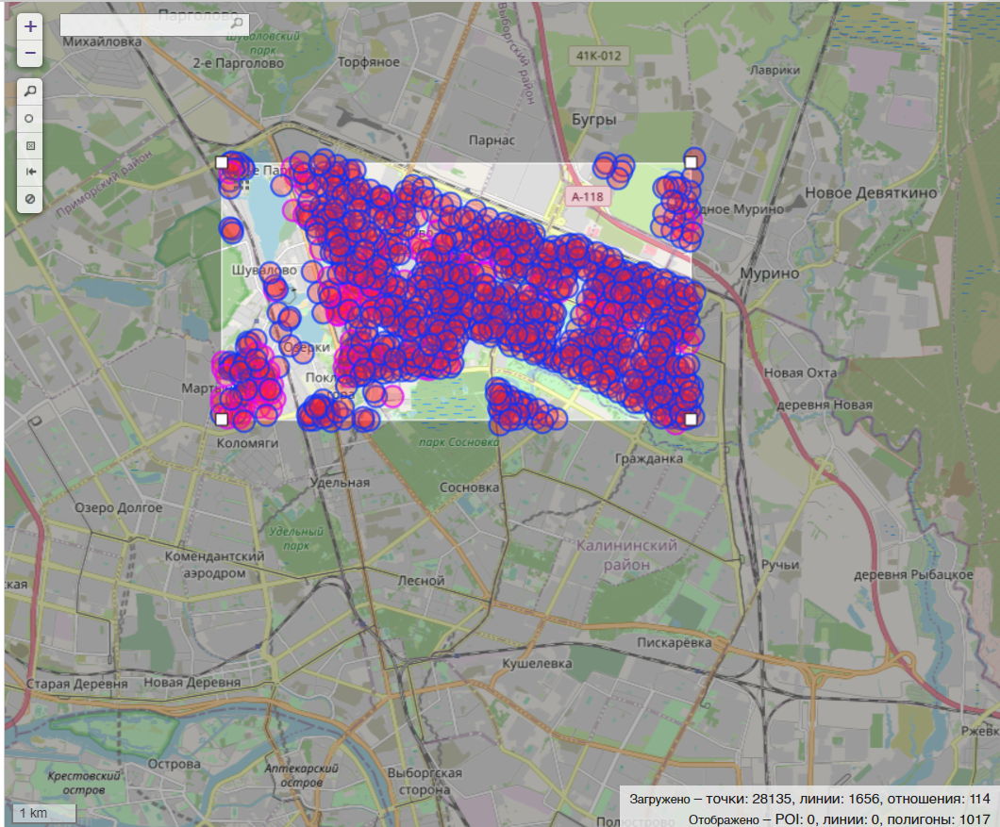

-   объединить или разъединить категории

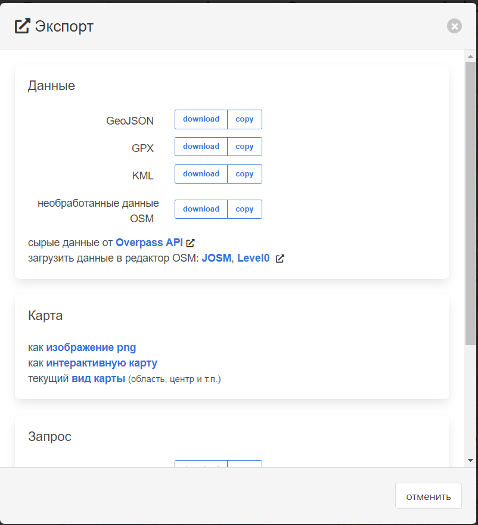

-   поменять название, под которым категория будет отображаться в легенде, для чего нужно дважды щелкнуть мышкой в конкретной категории в графе **Легенда** и ввести нужное название

Кроме того, можно изменять цвет и вид символа для отдельных категорий. Для этого достаточно дважды щелкнуть мышкой напротив символа конкретной категории.

После настройки стиля слоя под его названием появляется легенда, с помощью которой можно делать отдельные категории невидимыми (для этого достаточно убрать галочку в чекбоксе напротив названия категории).

> **Задание**: самостоятельно настроить цвет и вид символов на карте по своему усмотрению

#### Кластеры

Для того, чтобы не перегружать карту объектами, можно настроить стиль точечного слоя в виде кластеров. В этом случае близко расположенные точки будут собираться в группы-кластеры.

Продублируем наш исходный слой

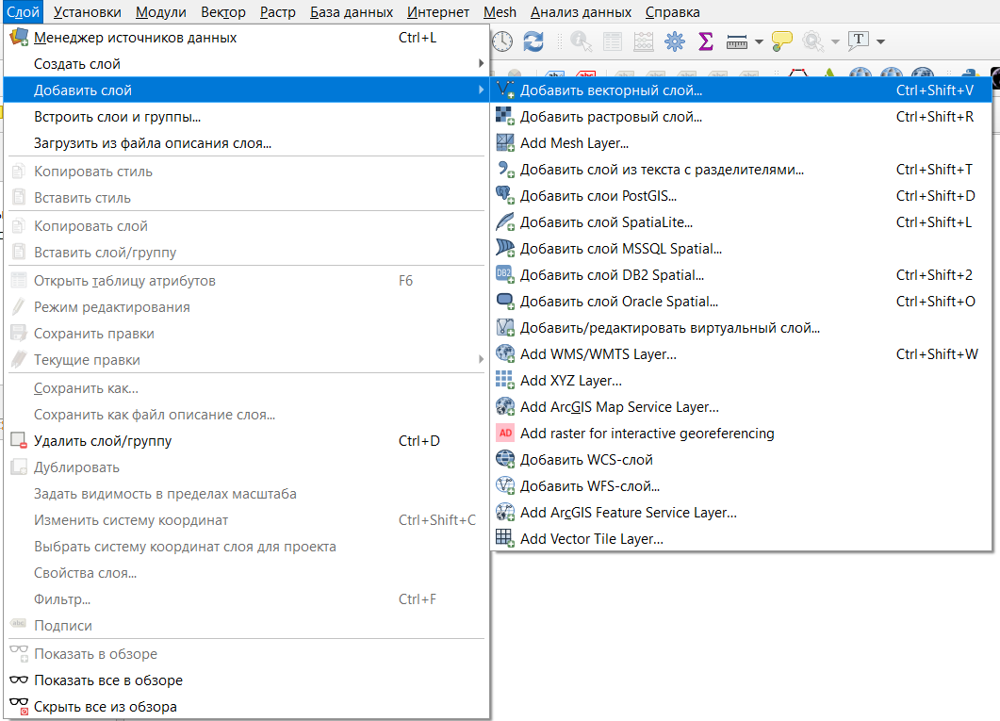

После этого отключим видимость ранее исходного слоя и включим слой дубликат (видимость слоев включается и отключается простановкой галочки в чекбоксе).

Для настройки стиля откроем свойства слоя дубликата и выберем тип знака **Point cluster**.

Здесь можно настроить символ кластера, рендерер и расстояние, на котором объекты будут группироваться друг с другом. При этом кластеры будут динамически пересчитываться при увеличении и уменьшении масштаба карты.

Рендерер в данном случае - это тоже настройка символа кластера, похожая на настройку простых точечных символов.

В нашем случае рендерер унаследовал настройку по уникальным значениям от простого символа, но при необходимости можно дополнительно что-то скорректировать в **Renderer settings**.

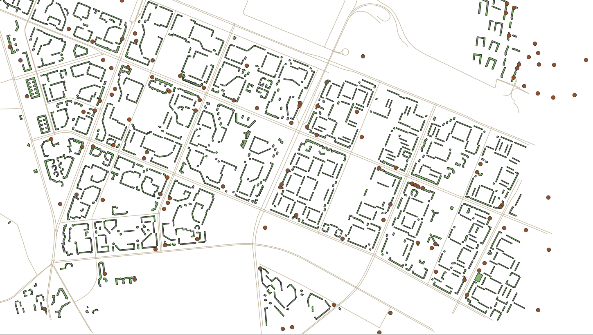

Настройка символа происходит аналогично настройке простого маркера.

В результате будет получена подобная карта.

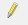

#### Тепловая карта

Еще раз продублируем слой, чтобы рассмотреть создание тепловой карты.

Откроем настройки продублированного слоя и выберем стиль **Создание теплокарт**.

Вы можете задать радиус тепловой карты в миллиметрах, точках, пикселях, единицах карты или дюймах, выбрать и отредактировать цветовую рампу для стиля тепловой карты и использовать ползунок для выбора компромисса между скоростью и качеством рендеринга. Вы также можете определить предел максимального значения и придать вес точкам с помощью поля или выражения. При добавлении или удалении объекта рендерер тепловой карты автоматически обновляет стиль тепловой карты.

> Главный недостаток тепловых карт в том, что они не дают четких значений плотности объектов, поэтому подходят только для отображения общих паттернов.

> **Задание:** подобрать подходящий градиент и настроить тепловую карту.

В результате создания тепловой карты должен быть получен подобный результат.

## Оформление карты {#layout}

### Создание макета

Просто сохранить карту в виде изображения можно через строку меню **Проект --- Импорт/Экспорт --- Экспортировать карту как изображение (Экспортировать карту в PDF)**.

В открывшемся окне можно настроить масштаб, охват карты, разрешение, аннотации и прочее. Но такой метод не позволяет сделать некоторые точные настройки экспорта.

Некоторые настройки оформления можно добавить через пункт меню **Вид --- Оформление**.

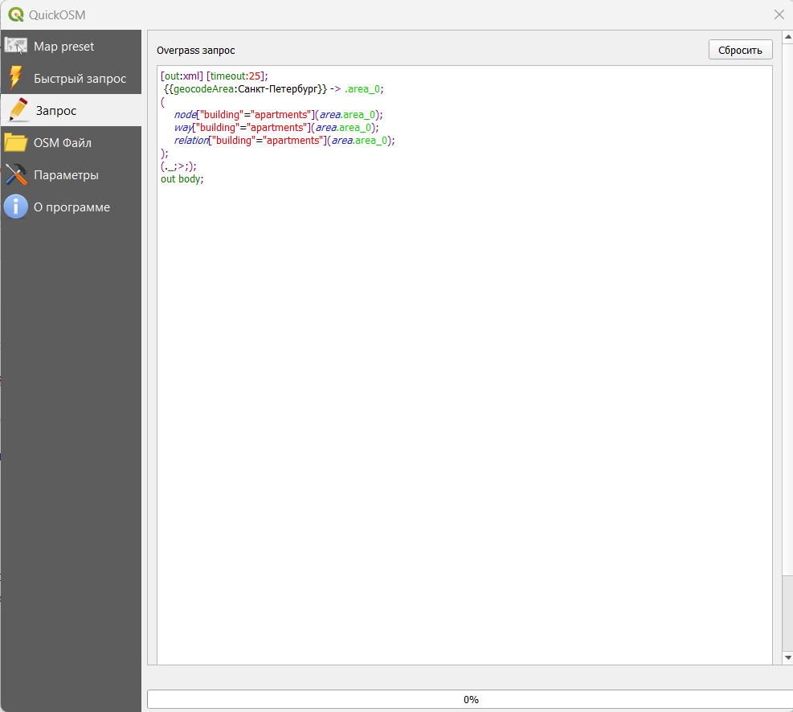

Более предпочтительным методом публикации являются макеты, которые сохраняются как часть проекта и позволяют кастомизировать результат публикации. Создание макета происходит через строку меню **Проект --- Создать макет**.

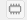

После создания макета открывается отдельное окно, в котором происходит настройка карты для публикации.

По левому краю расположены значки добавления различных элементов оформления на макет, в правой части окна сверху будут перечислены добавленные на макет элементы, а в правой нижней части окна будут отображаться свойства элементов. В центральной части расположен лист, на котором будет размещаться карта и добавленные на нее элементы.

### Настройка макета

#### Параметры листа

Чтобы настроить размер и ориентацию листа, нужно открыть его параметры. Параметры листа открываются в контекстном меню, которое появляется после нажатия правой кнопкой мыши на лист.

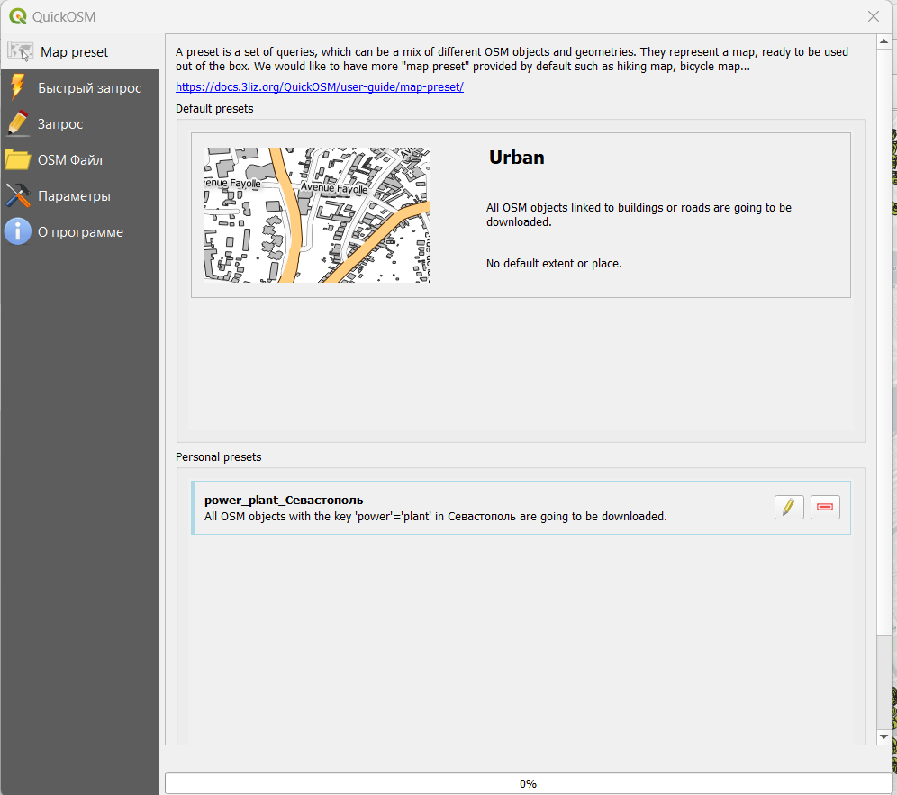

После этого в правой части окна появятся настройки параметров листа.

Добавить новый лист в макет можно кнопкой **Добавить листы**.

#### Добавление карты

Добавление карты на лист осуществляется инструментом **Добавить Карта** на левой панели окна макета 

После выбора этого инструмента нужно щеклнуть на любом месте листа, чтобы карта была добавлена. После этого открывается диалоговое окно, в котором можно настроить положение и размер элемента (не обязательно, так как это положение и размер можно скорректировать вручную уже на листе после добавления).

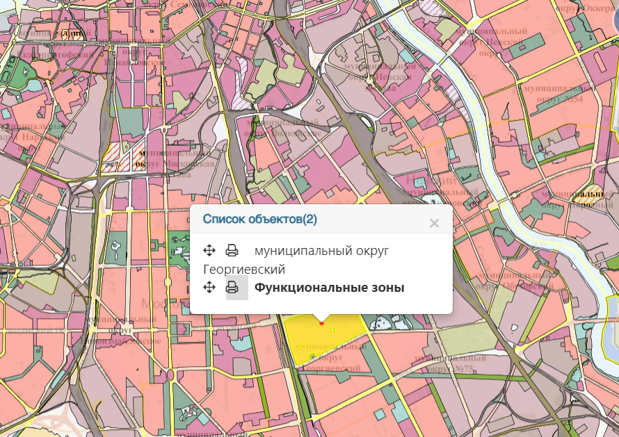

После добавления карта должна появиться на листе, а в правой части окна появятся ее настройки.

Изменить размер элемента можно просто потянув за один из белых квадратиков по периметру элемента. При этом можно увидеть, что сразу меняется масштаб и границы карты.

> На добавленной карте отображаются те слои, которые в данный момент являются видимыми в основном окне программы.

Основные настройки элемента:

-   масштаб - рассчитывается в зависимости от того, какая область попадает в элемент, при необходимости может быть введен нужный знаменатель масштаба;

-   вращение - карту можно развернуть на листе под любым углом;

-   система координат - система координат, в которой карта отображается на макете, по умолчанию система координат проекта;

-   заблокировать слои - так как на карте отображаются видимые в конкретный момент времени слои, то она будет обновляться и меняться после включения/отключения/добавления новых слоев, поэтому можно выбрать нужные для отображения слои, сделать их видимыми в основном окне, потом заблокировать слои на макете и содержание карты больше не будет меняться; при необходимости блокировку можно снять;

-   границы помогают задать охват карты.

#### Масштабная линейка

Для отображения масштаба карты на нее нужно добавить масштабную линейку (линейный масштаб) с помощью инструмента **Добавить Масштабная линейка** 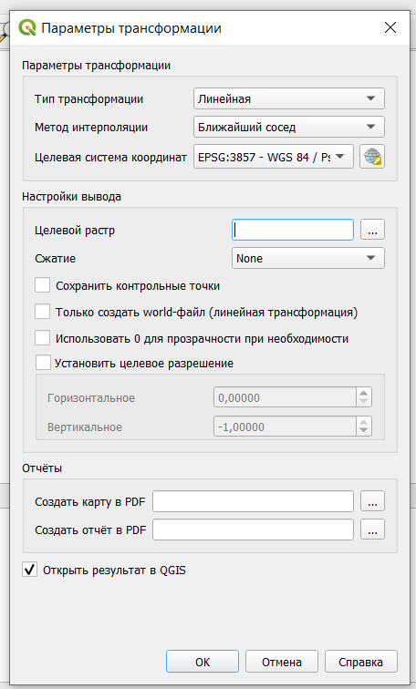{width="35" height="30"}

Процесс добавлени происходит аналогично добавлению карты на лист.

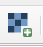

Основные настройки масштабной линейки:

-   карта - то, для какого элемента карты добавляется линейка (в нашем случае всего один элемент карты, если их несколько можно сделать выбор);

-   стиль линейки

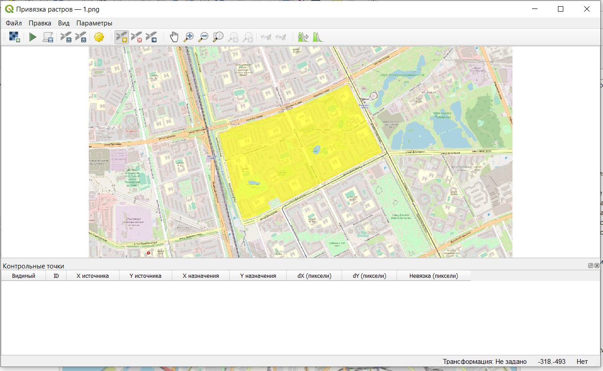

-   единицы масштабной линейки - единицы измерения на линейном масштабе;

-   множитель единиц масштабной линейки - во сколько раз уменьшить значения на масштабной линейке;

-   подпись единиц измерения;

-   number format - формат чисел на линейном масштабе;

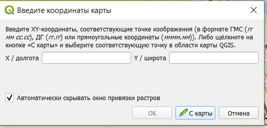

-   сегменты - количество сегментов слева от нуля и справа от нуля;

-   фиксированная ширина - размер сегмента в единицах измерения карты;

-   зафиксировать длину сегмента - размер сегментов линейного масштаба в единицах измерения листа.

#### Легенда

Добавим на карту легенду, с помощью кнопки Добавить Легенда .

По умолчанию на легенду добавляются все слои, которые есть в вашем проекте. Чтобы в легенде отображались только видимые слои, нужно поставить галочку в чекбоксе **Only show items inside linked map**.

Названия слоев и категорий в легенде отображаются также, как и в основном окне программы, поэтому, чтобы кастомизировать содержание легенды, нужно убрать галочку напротив функции **Auto update** и после этого осуществить необходимые настройки.

> **Задание:** сделать макет из трех листов, на одном из которых будет карта магазинов в виде простых символов, на втором - карта кластеров, на третьем - тепловая карта.
