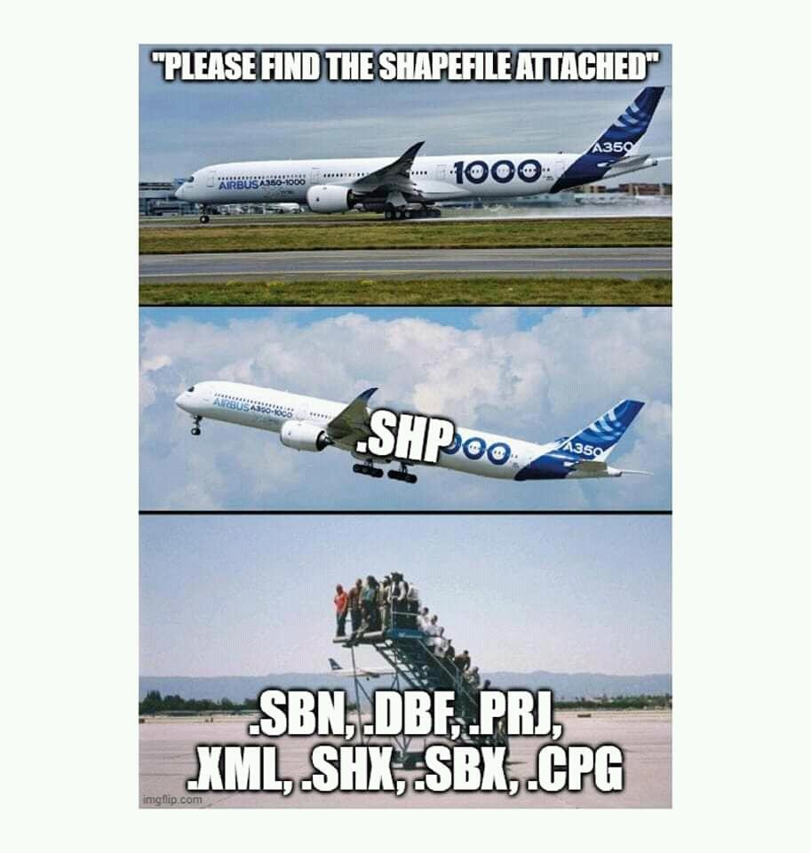
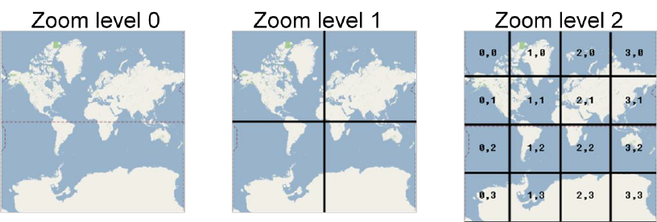

# Форматы данных, используемые в ГИС {#formats}

Основные типы данных, используемые в геоинформационных системах - растровые и векторные данные.


**Растровые данные** - это матрица или сетка, в каждой ячейке (пикселе) которой содержится числовое значение. В качестве растровых данных могут быть использованы цифровые изображения или значения непрерывных величин (например, рельеф).


В **векторных данных** местоположение объектов задается с помощью координат и математических формул. В геоинформационных системах используются специализированные форматы векторных данных, позволяющие хранить как информацию о местоположении объектов, так и их атрибутивные (непространственные) характеристики.


## Векторные форматы данных {#vector}

{width="500"}

Главная особенность векторных форматов данных, используемых в ГИС в том, что они позволяют не только определять местоположение и геометрию обьектов, но и также их описательные непространственные характеристики (то, что, как правило, называют атрибутивными данными). Кроме того, большинство из этих форматов поддерживают работу с различными картографическими проекциями и системами координат.

Например, системы автоматизированного проектирования (AutoCAD, NanoCAD и подобные им) также могут работать с геометрическими характеристиками объектов и их местоположением, но работа в них осуществляется только в плоской прямоугольной системе координат, а возможность работы с атрибутивными данными отсутствует.

### Shape файлы

Наиболее часто используемым форматом векторных данных в ГИС является **shapefile**[^02-data-formats-1]. Этот проприетарный формат данных от компании ESRI, который был разработан ими в 90-х годах прошлого века. Это был первый формат векторых данных, созданный специально для работы в ГИС.

[^02-data-formats-1]: ESRI Shapefile Technical Description --- Электрон. дан. --- <https://www.esri.com/content/dam/esrisites/sitecore-archive/Files/Pdfs/library/whitepapers/pdfs/shapefile.pdf>

При использовании этого формата данные хранятся в нескольких файлах с разными расширениями, обязательными из которых являются:

\- .shp - геометрия объектов;

\- .shx - файл индексов необходим для ускорения расчетов и связи геометрии и атрибутов;

\- .dbf - таблица атрибутов:

\- .prj - сведения о проекции и системе координат.

Без перечисленных выше файлов данные не будут корректно открываться и обрабатываться в ГИС.

{width="500"}

Недостатки работы с shape файлами[^02-data-formats-2]:

[^02-data-formats-2]: Switch from Shapefile <http://switchfromshapefile.org/>

-   в файле не задается система координат;

-   состоит из нескольких файлов;

-   названия атрибутов должны быть не длинее 10 букв;

-   всего можно добавить не более 255 атрибутов;

-   ограниченное количество типов данных в атрибутах;

-   файл должен быть не более 2 Гигабайт;

-   не описываются топологические отношения объектов;

-   в файле могут быть только объекты с одним типом геометрии;

-   и прочие.

### Geojson

Постепенно на замену shapefile приходят другие форматы данных, например, **GeoJSON** - формат представления различных структур географических данных, основанный на [JavaScript object notation (JSON)](https://ru.wikipedia.org/wiki/JSON).

В GeoJSON объект состоит из набора пар *ключ/значение*, также называемых свойствами. Имя каждого свойства -- строка. Значение свойства может представлять собой строку, число, объект, массив или один из литералов: «true», «false» и «null». Массив состоит из элементов, где каждый элемент может принимать одно из значений, описанных выше.

Пример GeoJSON:

```         
{
  "type": "Feature",
  "geometry": {
    "type": "Point",
    "coordinates": [125.6, 10.1]
  },
  "properties": {
    "name": "Dinagat Islands"
  }
}
```

Формат поддерживает следующие типы объектов `Point`, `LineString`, `Polygon`, `MultiPoint`, `MultiLineString`, and `MultiPolygon`.

Геометрические объекты с атрибутивными характеристиками составляют `Feature` объекты. Наборы объектов хранятся как `FeatureCollection` объекты[^02-data-formats-3]. Полное описание формата представлено [здесь](https://datatracker.ietf.org/doc/html/rfc7946).

[^02-data-formats-3]: <https://geojson.org/>

Для проверки и валидации geojson файлов можно пользоваться сервисом [geojson.io](https://geojson.io/)

Существует еще дополненная версия **topojson**, в котором учитываются топологические отношения между объектами. В этом формате вместо того, чтобы представлять геометрию дискретно, геометрия в файлах TopoJSON сшивается из общих линейных сегментов, называемых *дугами*[^02-data-formats-4].

[^02-data-formats-4]: <https://github.com/topojson/topojson>

### Geopackage

Также все более широкое распространение получает формат **GeoPackage**, который фактически является файлом SQL-базы данных с расширением **.gpkg**[^02-data-formats-5].

[^02-data-formats-5]: Getting Started With GeoPackage --- Электрон. дан. --- <http://www.geopackage.org/guidance/getting-started.html>

{width="350"}

GeoPackage - это *контейнер SQLite*, а стандарт кодирования GeoPackage определяет правила и требования к контенту, хранящемуся в контейнере.

Стандарт GeoPackage определяет схему, включая определения таблиц, утверждения целостности, ограничения формата и ограничения содержимого. Требуемый и поддерживаемый контент GeoPackage полностью определен в стандарте. Эти возможности построены на общей основе, и механизм расширения предоставляет разработчикам возможность включить дополнительные функции в свои GeoPackages.

Стандарт кодирования GeoPackage описывает набор соглашений для хранения следующего в базе данных SQLite:

-   векторные объекты;

-   наборы тайловых матриц изображений и растровых карт в различных масштабах;

-   атрибуты (непространственные данные);

-   дополнения.

Вот здесь еще можно посмотреть презентацию про shape файлы и их альтернативы <https://www.slideshare.net/jachym/switch-from-shapefile>

Кроме этих форматов в ГИС также могут использоваться и некоторые другие, например, **GPX** (формат обмена данными GPS)[^02-data-formats-6], **KML**[^02-data-formats-7] (формат файлов, который используется для отображения географических данных в геобраузерах, таких как Google Планета Земля, Google Карты и Google Карты для мобильных устройств; создан на основе стандарта XML).

[^02-data-formats-6]: GPX: the GPS Exchange Format <https://www.topografix.com/gpx.asp>

[^02-data-formats-7]: Руководство по KML <https://developers.google.com/kml/documentation/kml_tut?hl=ru>

### KML

**KML** -- это формат файлов, который используется для отображения географических данных в геобраузерах, таких как Google Планета Земля, Google Карты и Google Карты для мобильных устройств. KML создан на основе стандарта XML и использует основанную на тегах структуру с вложенными элементами и атрибутами.

*Заголовок XML*: с него начинается каждый KML-файл. Перед заголовком не должно быть никаких символов или пробелов.

*Декларация пространства имен KML*: вторая строка каждого файла формата KML 2.2.

*Объект Placemark*, содержащий следующие элементы: name -- имя, которое используется в качестве ярлыка метки;

*description* -- описание, которое отображается во всплывающем окне, привязанном к метке;

*Point* -- координаты, определяющие положение метки на земной поверхности (долгота и широта, иногда также высота).

```         
KML-код простой метки. 
<?xml version="1.0" encoding="UTF-8"?>
      <kml xmlns="http://www.opengis.net/kml/2.2"> <Placemark>
      <name>Простая метка</name>
      description>Привязана к земной поверхности. Приспосабливается к рельефу местности.</description>
      <Point>
      <coordinates>-122.0822035425683,37.42228990140251,0</coordinates>
      </Point>
      </Placemark> </kml>
```

### GPX

**GPX (англ. GPS eXchange Format)** --- свободный текстовый формат хранения и обмена данными GPS, основанный на XML.

Формат позволяет хранить информацию об *ориентирах (waypoints), маршрутах (routes) и треках (tracklogs)*.

Для каждой точки хранятся её долгота, широта и высота над уровнем моря (если имеется информация о высоте). Для точек трека хранится также время прохождения точки.

XML-схема предусматривает также хранение *произвольной пользовательской информации* по каждой точке, обязательными являются только долгота и широта.

Широта и долгота в GPX указывается в градусах в системе координат WGS 84.

Высота указывается в метрах над уровнем моря.

Примером пользовательской информации может быть *высота местности (ele), скорость, частота пульса (hr), число шагов, темп вращения педалей (каденс, cad)*, температура и им подобные параметры.

```         
<?xml version="1.0" encoding="UTF-8"?>
<gpx version="1.0">
    <name>Example gpx</name>
    <wpt lat="46.57638889" lon="8.89263889">
        <ele>2372</ele>
        <name>LAGORETICO</name>
    </wpt>
    <trk><name>Example gpx</name><number>1</number><trkseg>
        <trkpt lat="46.57608333" lon="8.89241667"><ele>2376</ele><time>2007-10-14T10:09:57Z</time></trkpt>
        <trkpt lat="46.57619444" lon="8.89252778"><ele>2375</ele><time>2007-10-14T10:10:52Z</time></trkpt>
        <trkpt lat="46.57641667" lon="8.89266667"><ele>2372</ele><time>2007-10-14T10:12:39Z</time></trkpt>
        <trkpt lat="46.57650000" lon="8.89280556"><ele>2373</ele><time>2007-10-14T10:13:12Z</time></trkpt>
        <trkpt lat="46.57638889" lon="8.89302778"><ele>2374</ele><time>2007-10-14T10:13:20Z</time></trkpt>
        <trkpt lat="46.57652778" lon="8.89322222"><ele>2375</ele><time>2007-10-14T10:13:48Z</time></trkpt>
        <trkpt lat="46.57661111" lon="8.89344444"><ele>2376</ele><time>2007-10-14T10:14:08Z</time></trkpt>
    </trkseg></trk>
</gpx>
```

### WKT

**WKT (Well-known text)** --- текстовый формат представления векторной геометрии и описания систем координат[^02-data-formats-8].

[^02-data-formats-8]: <https://ru.wikipedia.org/wiki/WKT>


## Растровые форматы данных {#raster}

### GeoTIFF

**GeoTIFF** --- открытый формат представления растровых данных в формате TIFF совместно с метаданными о географической привязке (геореференцированный растр).

Использует спецификации TIFF 6.0, в которую добавляет несколько видов геотегов, которые определяют вид картографической проекции, систему географических координат, модель геоида, датум и любую другую информацию, необходимую для точного пространственного ориентирования изображения.

Приложения, поддерживающие только формат TIFF 6.0, но не GeoTIFF, могут открывать изображения, получая базовый растр без метаинформации.

В тегах GeoTIFF может задаваться:

-   Вид картографической проекции или систему географических координат

-   Параметры (датум) земного геоида

-   Дискреты разрешения изображения

-   Матрицу полиномиального, сплайнового или аффинного преобразования

-   Характерные параметры изображения

## Тайловые данные {#tiles}

Название **тайловый слой** (от англ. tile - плитка) обусловлено тем, что получаемое такими слоями изображение некоторой карты составляется из набора заранее подготовленных картинок фиксированного размера т.н. тайлов, которые размещаются на плотной сетке рядом друг с другом

При максимальном масштабе вся карта покрывается одним единственным тайлом, который изображает всю площадь карты, но делает это наименее детализировано, как бы "с высоты птичьего полёта".



При минимальном же масштабе карта покрывается достаточно большим количеством тайлов, каждый из которых максимально детализировано изображает соответствующий ему участок карты. Множество доступных масштабов карты от максимального до минимального равномерно разбивается на конечное число, каждому из которых ставится в соответствие целочисленное обозначение, это так называемый зум (от англ. zoom level - уровень увеличения/уровень масштабирования), который принимает значение 0 для максимального масштаба, и некоторое n для минимального, как правило n = 18, но может быть как меньше так и больше.

Любой тайловый слой запрашивает подготовленные таким образом изображения у специализированных тайловых сервисов, сообщая им зум и координаты изображений, соответствующих просматриваемой области карты. Однако т.к. для любого значения зума сетка состоит из конечного числа тайлов, а именно 2\^(zoom\*2) (т.е. 1, 4, 16, 64, ...), то географические координаты просматриваемой области карты, перед обращением к сервису, преобразуются в целочисленные координаты тайловой сетки для указанного зума.


Как правило, тайловые слои используются в качестве подложек.

Такие слои состоят из прямоугольников\\квадратов одинакового размера, что отчасти обуславливает использование проекции Меркатора в различных веб-сервисах с использованием карт и тайловых слоев, так как именно эта проекция позволяет добиться универсальности формы тайлов за счет того, что меридианы направлены снизу вверх параллельно друг другу, а параллели - перпендикулярны меридианам и параллельны друг другу. Именно это и позволяет "нарезать" карту мира на прямоугольные фрагменты примерно одинакового размера.

Использование немеркаторовских проекций, в которых не выполняется условие параллельности и перпендикулярности меридианов и параллелей долгое время не поддерживались в веб-картах из-за сложности реализации (невозможность получить универсальные по форме и размеру тайлы, необходимость создания плавного перехода между уровнями увеличения), но в конце 2021 года компания Mapbox первой объявила о том, что их сервисы начали поддержку других проекций[^02-data-formats-9].

[^02-data-formats-9]: REIMAGINING PROJECTIONS FOR THE INTERACTIVE MAPS ERA <https://www.mapbox.com/blog/adaptive-projections>


## Проект QGIS

Сохранение проекта в QGIS - это фактически сохранение текущего рабочего сеанса со всеми добавленными слоями (во всех форматах) и их настройками.

Информация, сохраняемая в файле проекта, включает в себя:

-   Добавленные слои

-   к каким слоям могут осуществляться запросы

-   Свойства слоев, включая символизацию и стили

-   Примечания к слоям

-   2D- и 3D-виды карты

-   Проекция для каждого вида карты

-   охват последнего просмотра для каждой карты

-   Макеты для печати

-   Печать элементов макета с настройками

-   Настройки печати макета атласа

-   Настройки оцифровки

-   Взаимосвязи таблиц

-   Макросы проекта

-   Стили проекта по умолчанию

-   Настройки плагинов

-   Настройки QGIS Server с вкладки "Настройки OWS" в свойствах проекта

-   Запросы, хранящиеся в диспетчере БД
