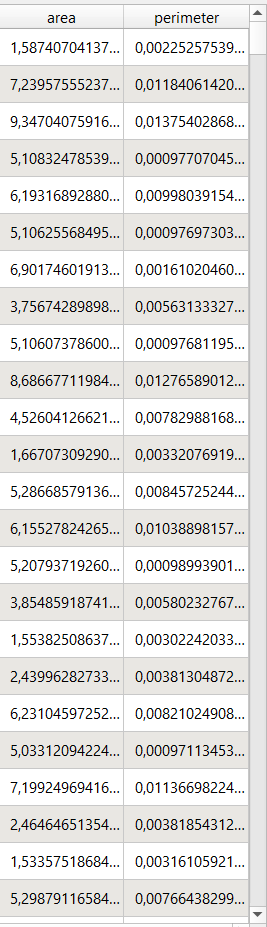
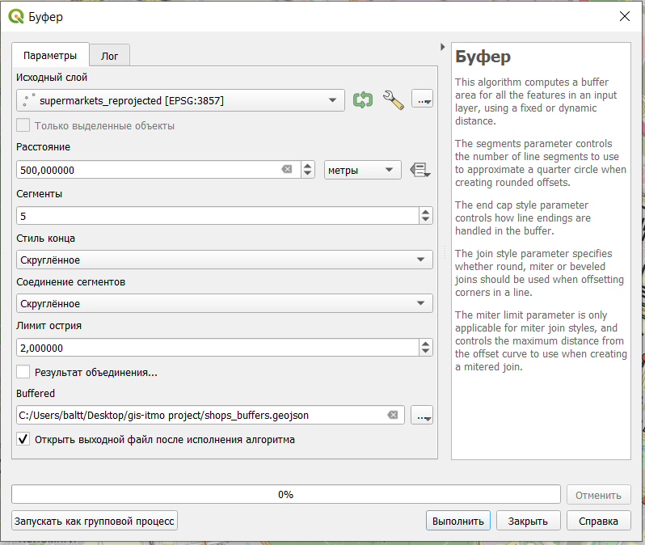

# Базовые операции пространственного анализа {#spatial-basics}

## Фильтрация данных

Фильтрация данных в слое позволяет оставить на карте только те объекты, которые соответствуют определенным условиям.

Запрос при создании фильтра задается в виде sql-подобного выражения.

Отфильтруем данные о супермаркетах. Сначала откроем окно настройки фильтра.

> Фильтры можно включать только для нередактируемых в данный момент слоев.

Окно фильтра выглядит вот так.

Введем нужное условие фильтрации (в нашем случае значение в поле brand не должно быть нулевым).

После нажатия кнопки **Проверить**, должно отобразиться, сколько объектов получено в отфильтрованном слое.

> При фильтрации объекты не удаляются, а просто перестают отображатьтся на карте и в таблице атрибутов, работа ведется только с объектами, соответствующими условиям фильтрации.
>
> Фильтр можно отключить, открыв окно его настройки и нажав кнопку **Очистить**.

## Определение площадей, периметра и длин линий

Определить площадь и периметр площадных объектов можно с помощью функции добавления геометрических параметров объектов к атрибутивной таблице или с помощью **Калькулятора полей**.

### Добавление атрибутов геометрии

Для того, чтобы добавить геометрические атрибуты слоя, нужно в строке меню выбрать **Вектор --- Обработка геометрии --- Добавить атрибуты геометрии**.

После чего появится диалоговое окно настройки добавления атрибутов геометрии.

Как можно заметить в результате выполнения этой операции будет создан новый слой, содержащий те же атрибуты, что и в исходном, плюс геометрические параметры объектов слоя (набор этих характеристик зависит от типа объектов в слое).

Главный недостаток использования этого метода определения площадей, периметров и длин в том, что эти характеристики рассчитываются либо в системе координат слоя, либо в системе координат проекта, либо на эллипсе. То есть здесь не получится посчитать площадь, например, в квадратных метрах для слоя и проекта, у которых системы координат подразумевают использование градусных измерений.

В результате в таблице атрибутов в конце появятся колонки с геометрическими параметрами объектов.

### Расчет через калькулятор полей

При использовании калькулятора полей не будет создаваться новый слой, а результаты расчетов будут записаны в новое поле в таблице атрибутов.

Перед тем, как считать площадь нужно проверить единицы измерения, в которых будут проводиться расчеты. В строке меню нужно открыть настройки программы: **Установки - Параметры**. В открывшемся окне, нужно открыть **Инструменты**, где будут настройки инструментов измерения (**Инструменты**), в которых по умолчанию установлены единицы измерения расстояния - метры и единицы измерения - квадратные метры. При необходимости можно установить нужные единицы измерения.

Если единицы измерения установлены правильные, то можно переходить к определению площади. Для этого нужно открыть таблицу атрибутов слоя.

В таблице атрибутов нужно запустить **Калькулятор полей**  (четвертый справа значок на панели инструментов).

Далее нужно выбрать хотите ли вы записывать результат в новую колонку (поле) или внести в существующую. Мы запишем результаты в новое поле, для которого обязательно нужно указать имя и тип данных. Тип данных в данном случае нужен десятичное число с точностью (числом знаков после запятой) 2.

В нижней части калькулятора слева окно, в котором будет отображаться выражение, по которому осуществляются расчеты, посередине приведены все функции, которые можно использовать при расчетах, а справа - краткая справка по выбранной функции.

> Для определения площади есть две функции **\$area** и **area()**, входящие в группу **Геометрия**.
>
> Главная разница между ними в том, что функция **\$area** рассчитывает площадь по эллипсоиду (за основу берется эллипсоид системы координат проекта; если для проекта не задан эллипсоид, то пдлощадь будет определяться на плоскости), а функция **area()** рассчитывает площадь на плоскости в системе координат слоя.

После нажатия кнопки ОК, окно Калькулятора закроется, останется только окно таблицы атрибутов, в котором создана новая колонка с заданным именем и внесенными в нее значениями площади объектов.

Периметр рассчитывается аналогично, но с помощью функций **\$perimeter** или **perimeter()**.

> Результаты также могут записываться в уже существующее поле (**Обновить существующее поле**), но здесь важно помнить про тип данных в поле.

Использования **Калькулятора полей** этим, конечно, не ограничивается: с его помощью можно осуществлять различные вычисления между атрибутами ваших объектов. Полный перечень функций **Калькулятора полей** с их описанием есть в [официальной документации](https://docs.qgis.org/3.16/en/docs/user_manual/working_with_vector/functions_list.html).

## Буферные зоны

Для того, чтобы выполнять эту и последующие операции необходимо открыть панель инструментов анализа (**Вид --- Панели --- Инструменты анализа**).

Панель появится в правой части окна.

Буферизация обычно создает две области: одна в пределах  указанного расстояния от выбранного объекта реального мира, другая - вне. Область, которая находится в пределах указанного расстояния называется буферная зона[^spatial-analysis-basics-1].

[^spatial-analysis-basics-1]: Vector Spatial Analysis (Buffers) <https://docs.qgis.org/2.8/en/docs/gentle_gis_introduction/vector_spatial_analysis_buffers.html>

С помощью буферных зон может осуществляться построение радиусов обслуживания определенных объектов, радиусов распространения отдельных явлений, границ зон с особыми условиями использования территорий.

> Важно помнить, что размер буферной зоны может задаваться только в единицах измерения системы координат слоя.
>
> При необходимости слой нужно либо перепроецировать одноименным инструментом из панели инструментов анализа, либо просто пересохранить из контекстного меню слоя в нужной проекции командой *Сохранить как*.

Предположим, что нам нужно определить, какие дома находятся в шаговой 5-минутной доступности от магазинов, а какие нет. Установим радиус обслуживания магазинов 500 метров (примерно 6 минут при средней скорости пешехода 5 км в час).

В нашем случае мы строим буферы вокруг магазинов, для которых система координат подразумевает измерения  в градусах, поэтому размер буфера мы сможем задать только в градусах.

Чтобы задавать размер буфера в метрах, нам нужно сначала перепроецировать исходный слой с помощью инструмента **Перепроецировать слой**. В качестве целевой системы координат можно выбрать системы `EPSG:3857`, результаты лучше сохранить в файл.

> Помните, что временные слои существуют только во время текущего сеанса работы, после закрытия программы, они удаляются.

Новый перепроецированный слой будет отличаться от исходного только системой координат.

Также перепроецирование слоя можно выполнить через команду **Экспорт --- Сохранить объекты как** контекстного меню слоя.

Далее мы можем создать буферы размером 500 метров для магазинов на основе перепроецированного слоя (результаты лучше сразу сохранить в файл).

Параметры, которые задаются при создании буферных зон:

-   *расстояние* - радиус буферной зоны, ее размер;

-   *сегменты* - число сегментов для отрисовки закругленного конца буферной зоны;

-   *стиль конца* - как будут отрисовываться концы буферных зон для линейных объектов (доступные варианты: скругленное, плоские, квадратное);

-   *соединение сегментов* - как должны соединяться между собой части буферной зоны на поворотах линейных объектов (скругленное, острое или фаска);

-   *лимит острия* - размер острия при соединении (только для острого соединения сегментов);

-   *результат объединения* - если будет поставлена галочка в чекбоксе, то все буферные зоны будут объединены в один объект.

В результате должно получиться что-то подобное

## Поиск объектов, попадающих в радиус обслуживания

Далее мы можем осуществить поиск домов, которые попадают в заданные области обслуживания.

Для поиска объектов есть группа инструментов **Вектор --- Выбор**.

Часть инструментов в ней начинается со слова Выбрать, а часть - Извлечь. Разница между ними в том, что в первом случае объекты просто выделяются в исходном слое, а во втором - объекты, соответствующие заданным условия, извлекаются в новый слой.

Краткое описания инструментов:

-   *выбрать\\извлечь по атрибуту* - поиск объектов по значению одного из атрибутов;

-   *выбрать\\извлечь по выражению* - поиск объектов по значениям нескольких атрибутов одновременно;

-   *выбрать\\извлечь по пространственному отношению* - поиск объектов по их расположению относительно объектов другого слоя;

-   *выбрать\\извлечь случайно* - случайная выборка объектов из слоя (заданного числа объектов или заданного процента объектов);

-   *выбрать\\извлечь случайно в подмножествах* - сначала слой разбивается по категориям по одному из атрибутов, потом из каждой категории извлекается заданное число или заданный процент объектов.

Нам нужно определить, какие здания попадаются в буферные зоны, поэтому нужно воспользоваться **выбрать\\извлечь по пространственному отношению**.

Для выбора объектов нужно сначала указать в каком слое осуществляется поиск (слой со зданиями), геометрический оператор (как объекты расположены относительно объектов другого слоя) и слой для сравнения (буферные зоны). Геометрические операторы в данном случае лучше выбирать *Пересекает* и *В пределах*.

В результате выбранные объекты будут выделены желтым цветом на карте.

Функция **Извлечь по пространственному отношению** работает аналогично с почти теми же характеристиками, кроме того, что вы можете выбрать сохранить результаты во временный слой или в файл.

В результате вы получите новый слой, в котором будут содержаться только те объекты, которые соответствуют заданному условию.

## Оверлейные операции

Оверлейные операции являются одним из основных способов пространственного анализа. Название этих операций произошло от слова overlay - наложение. Суть оверлейных операций состоит в том, что два слоя накладываются друг на друга, после чего осуществляется какая-то операция (разность, обрезка и т.п.) в результате чего создается результирующий новый слой.

В QGIS можно выполнить следующие оверлейные операции: *Обрезать, Пересечение (Intersection), Объединение (Union), Симметричная разность (Symmetrical difference), Разность* *(Difference)*.

Эти операции также могут быть описаны логическими операторами.

Рассмотрим операции отдельно на примере наложения слоев с жилыми многоквартирными домами и буферными зонами супермаркетов.

При выполнении команды ***Пересечение*** в выходном слое содержатся только участки, в которых оба слоя пересекаются.

Команда ***Объединение*** совмещает слои таким образом, что в выходном слое содержатся как участки пересечения, так и участки, принадлежащие только одному из слоев.

> Слой можно объединить с самим собой, в этом случае объекты слоя будут разделены на фрагменты из перекрывающихся частей и непересекающихся.

Команда ***Симметричная разность*** оставляет в выходном слое только те участки, в которых исходные слои не пересекаются.

Команда ***Обрезать*** совмещает слои таким образом, что в выходном слое содержатся только те участки, которые пересекаются со слоем отсечения. Принципиальное отличие этой команды от пересечения в том, что сохраняется исходная геометрия объектов, тогда как при пересечении исходные объекты дополнительно рассекаются объектами накладывающегося слоя.

> Главное отличие этой операции от Пересечения в том, что исходные объекты не разрезаются по границам объектов оверлейного слоя.

Команда ***Разность*** совмещает слои таким образом, что в выходном слое содержатся только те участки, которые не пересекаются со слоем отсечения.

> Важно помнить, что результат оверлейных операций зависит от того, какой слой будет указан первым (будет исходным), а какой вторым (будет накладываться). В приведенных примерах везде слой буферных зон был исходным, а накладывался слой с сеткой.

Все оверлейные операции находятся с панели инструментов в группе **Вектор-Оверлей**[^spatial-analysis-basics-2].

[^spatial-analysis-basics-2]: Vector overlay [[https://docs.qgis.org/3.10/ru/docs/user_manual/processing_algs/qgis/vectoroverlay.html]{.ul}](https://docs.qgis.org/3.10/ru/docs/user_manual/processing_algs/qgis/vectoroverlay.html)

## Пространственное объединение

В ряде случаев возникает необходимость в том, чтобы объединить между собой таблицы атрибутов нескольких слоев. Эта задача может быть поставлена в нескольких вариациях:

-   к атрибутивной таблице одного слоя нужно добавить атрибуты другого слоя, при этом в таблицах есть общее поле - [**Соеднинить атрибуты по значению поля**](https://docs.qgis.org/3.16/en/docs/user_manual/processing_algs/qgis/vectorgeneral.html#join-attributes-by-field-value) (геометрия объектов берется из первого слоя, атрибутивные таблицы объединяются по общему полю);

-   к объектам одного слоя нужно присоединить атрибуты ближайших по местоположению объектов другого слоя - [**Соединить атрибуты по ближайшему**](https://docs.qgis.org/3.16/en/docs/user_manual/processing_algs/qgis/vectorgeneral.html#qgisjoinbynearest);

-   к объектам одного слоя нужно присоединить атрибуты объектов другого слоя, расположенных определенным образом по отношению к объектам первого слоя (с учетом геометрического предиката) - [**Присоединить атрибуты по пространственному положению**](https://docs.qgis.org/3.16/en/docs/user_manual/processing_algs/qgis/vectorgeneral.html#join-attributes-by-location);

-   к объектам одного слоя нужно присоединить рассчитанные статистические показатели на основе атрибутов объектов другого слоя, расположенных определенным образом по отношению к объектам первого слоя (с учетом геометрического предиката) - [**Присоединить атрибуты по пространственному положению (сводка)**](https://docs.qgis.org/3.16/en/docs/user_manual/processing_algs/qgis/vectorgeneral.html#qgisjoinbylocationsummary).

Все эти функции доступны в **Панели инструментов анализ**а в группе функций **Вектор**.

Определим, в каких жилых многоквартирных домах есть сетевые супермаркеты, и добавим их названия в таблицу атрибутов слоя домов.

Для этого нам необходимо воспользоваться функцией **Присоединить атрибуты по пространственному положению** в панели инструментов анализа.

Параметры, задаваемые при выполнении:

-   *base layer* - слой, к объектам которого будут добавляться атрибуты;

-   *присоединить слой* - слой, из которого будут добавляться атрибуты;

-   *geometric predicate* - то, каким образом расположены относительно друг друга объекты базового и присоединяемого слоя;

-   *fields to add* (необязательно) - то, какие атрибуты вы хотите присоденить (если не выполнить здесь выбор конкретных атрибутов, будут добавлены все атрибуты присоединяемого слоя);

-   *тип объединения* - как будет создан результирующий слой, если будет выявлено несколько совпадений между присоединяемым слоем и исходным: для каждого совпадения будет создан свой объект, объекты будут создаваться только для первых совпадений или атрибуты будут присоединяться только при наибольшем наложении объектов между слоями;

-   *отменить записи, которые не могут быть объединены* - при выборе этой опции, те объекты базового слоя, для которых не нашлось совпадений их присоединяемого слоя будут удалены из результата;

-   *префикс присоединенного поля* (необязательно) - добавление префикса к присоединяемым полям для избежания дублирования названий и выделения новых полей;

-   *связанный слой* - куда будут записаны результаты;

-   *несоединимые объекты из первого слоя* (необязательно) - слой, куда будут вынесены объекты исходного слоя, для которых не нашлось совпадений в присоединяемом слое.

## Агрегирование объектов

Рассчитаем плотность расположения супермаркетов в Санкт-Петербурге. Это осуществляется в 2 этапа:

1.  построение сетки (грида);

2.  расчет плотности.

### Построение сетки

Построение сетки осущестлвяется с помощью инструмента **Create grid** в панели инструментов анализа.

Параметры, задаваемые при построении сетки:

-   *вид сетки* - из каких объектов будет состоять построенная сетка, доступные варианты:

    -   точка

    -   линия

    -   rectangle (прямоугольник)

    -   diamond (ромб)

    -   hexagon (шестиугольник)

-   *grid extent* - охват сетки может задаваться либо по охвату одного из слоев, либо по охвату видимой части карты, либо быть указан на карте;

-   *horisontal/vertical spacing* - размеры ячейки сетки по высоте и ширине;

-   *horisontal/vertical overlay* - наложение ячеек сетки друг на друга;

-   *grid CRS* - система координат полученной сетки.

> Важно помнить, что размер ячеек сетки всегда должен быть обоснован.

В результате получим новый слой с сеткой

### Расчет плотности объектов

Фактически для того, чтобы определить плотность объектов, нам нужно посчитать, сколько объектов попало в каждую ячейку сетки. Эта операция осуществляется как пространственное соединение с расчетом сводного показателя (**Присоединить атрибуты по пространственному положению (сводка)**).

Параметры функции:

-   исходный слой - тот слой, к которому будет выполняться присоединение атрибутов;

-   связанный слой - слой, из которого будут браться атрибуты;

-   геометрический предикат - взаимное расположение двух слоев;

-   поля для суммирования (необязательно) - выбор атрибутов, которые необходимо присоединить;

-   резюме для расчета (необязательно) - какие характеристики необходимо рассчитать в процессе операции (если не будут заданы конкретные характеристики, то будут рассчитаны все, которые возможно с учетом типов данных в связанном слое);

-   отменить записи, которые не могут быть объединены - будут удалены объекты исходного слоя, для которых не нашлось совпадений в связанном слое.

В результатет получаем новый слой с рассчитанным нужным параметром.

Поля *id, left, top, right, bottom* были созданы при изначальном построении сетки, а в поле *brand_count* у нас содержится посчитанное число точек, попадающих в соотвествующую ячейку.

### Настройка стиля объектов в зависимости от количественной переменной

В разделе \@ref(style-basics) было немного упомянуто о настройках стиля слоя в зависимости от значений атрибута, но только на основе качественной характеристики. Рассмотрим настройку стиля объектов в зависимости от количественной переменной для слоя с плотностью супермаркетов.

Для этого нужно открыть настройки стиля и выбрать тип символа **Градуированный знак**, после чего выбрать атрибут на основе которого будет задаваться стиль и осуществить дальнейшую настройку.

> Градуированный знак может задаваться только на основе числового атрибута

Для того, чтобы появилась таблица с классификацией (легенда) нужно нажать кнопку **Классифицировать**.

Для классификации можно менять тип разбивки на группы (*Мода*) и число классов. Самые широко применяемые методы классификации:

-   *естественные интервалы Natural breaks* (создают группы так, чтобы разница между ними была максимальной),

-   *равные интервалы* (весь интервал изменения показателя делится на равные отрезки),

-   *равное количество (квантиль)* (при этом типе классификации во всех группах будет одинаковое количество объектов).

Чтобы лучше понять, как осуществилась разбивка на группы, можно перейти во вкладку *Гистограмма* и нажать *Load values*. После этого будет построен график распределения объектов  по величине показателя и показана разбивка на группы.

Полученный результат вместе с легендой отображается на карте.

