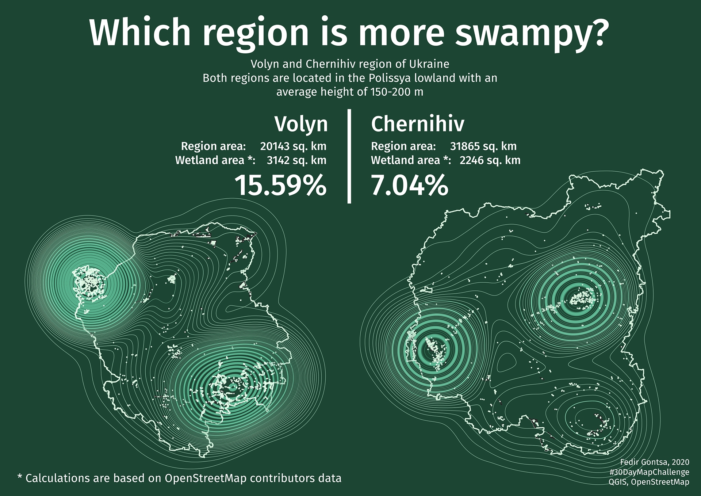
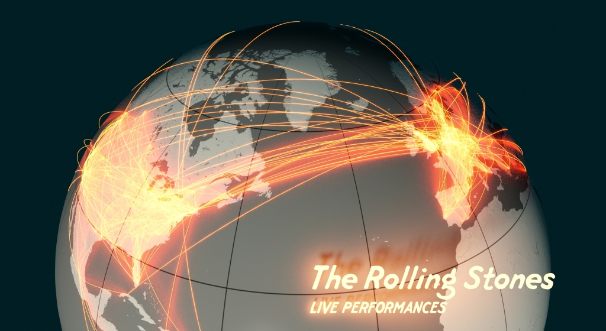
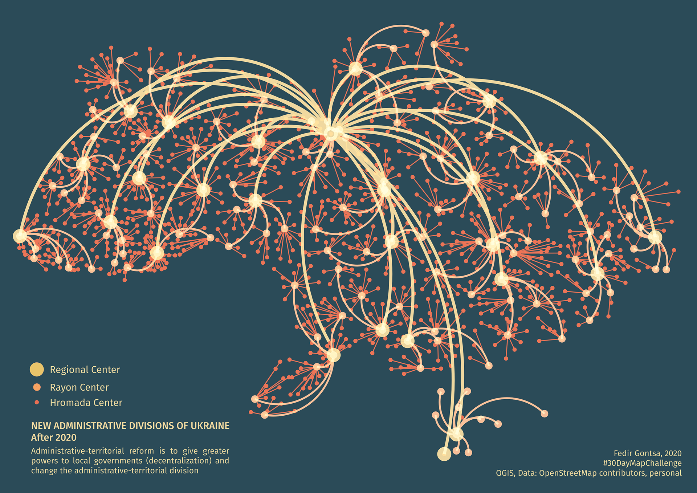
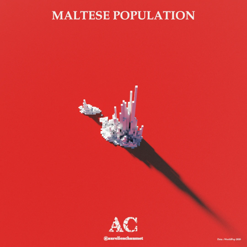
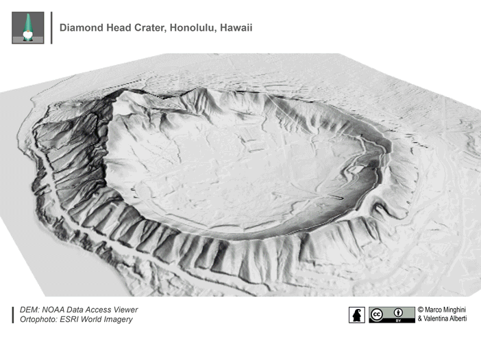
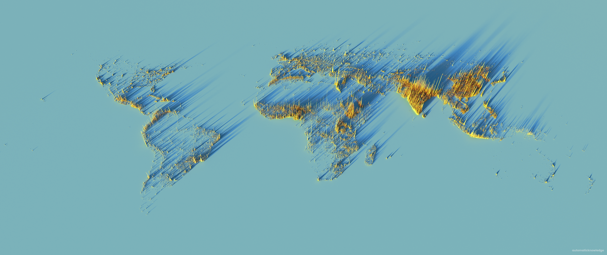
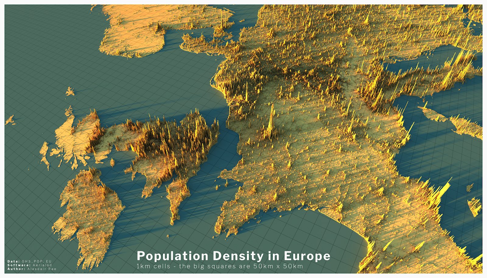
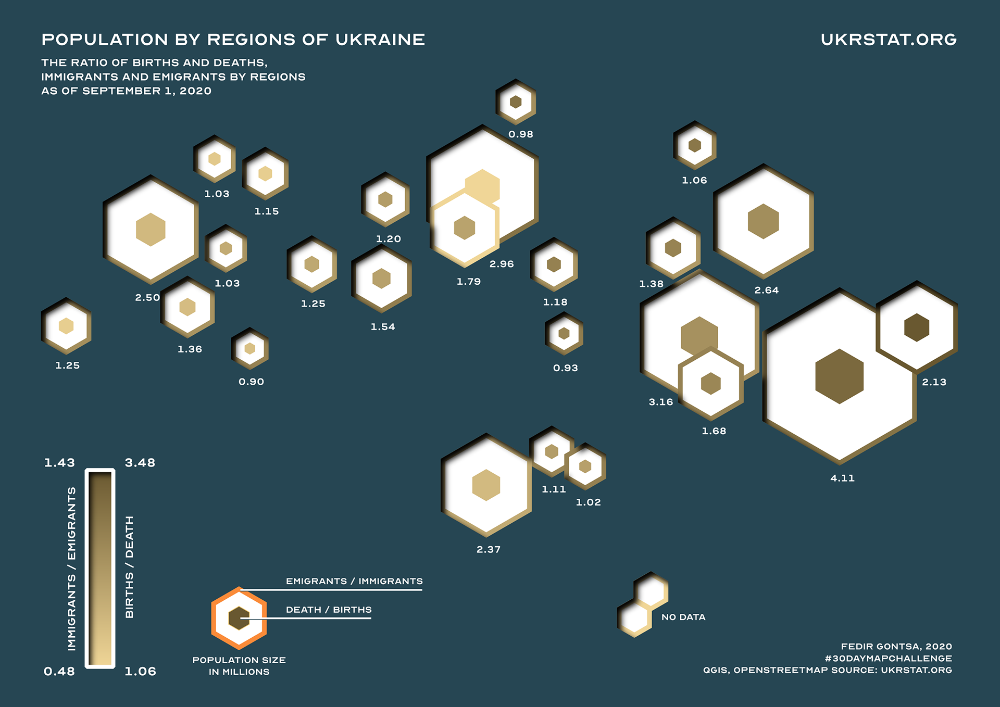
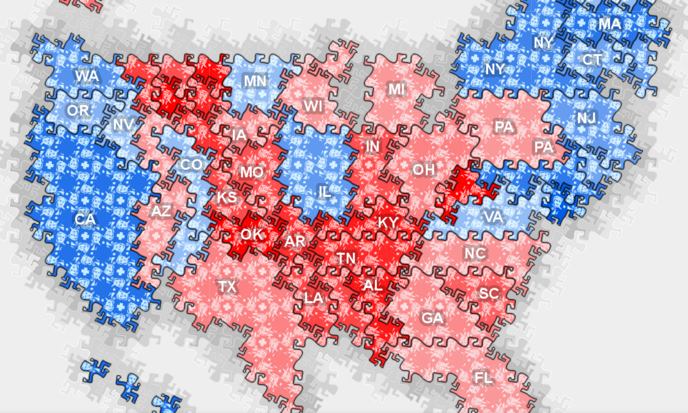

------------------------------------------------------------------------

------------------------------------------------------------------------

# Методы представления географических данных {#visualisation}

> Not only is it easy to lie with maps, it's essential. To portray meaningful relationships for a complex, three-dimensional world on a flat sheet of paper or a video screen, a map must distort reality. As a scale model, the map must use symbols that almost always are proportionally much bigger or thicker than the features they represent. To avoid hiding critical information in a fog of detail, the map must offer a selective, incomplete view of reality. There's no escape from the cartographic paradox: to present a useful and truthful picture, an accurate map must tell white lies.[^visualisation-1]
>
> Солгать с помощью карт не только легко, но и необходимо. Чтобы изобразить значимые взаимосвязи сложного трехмерного мира на плоском листе бумаги или видеоэкране, карта должна искажать реальность. Как в масштабной модели, на карте должны использоваться символы которые почти всегда пропорционально намного больше или толще чем объекты, которые они представляют. Чтобы не скрыть важную информацию в массе деталей, карта должна давать выборочный, неполный взгляд на реальность. Невозможно избежать картографического парадокса: чтобы представить полезную и правдивую картину, точная карта должна говорить белую ложь.

[^visualisation-1]: Monmonier, Mark S. 1996. *How to lie with maps*.

> Each map is a manifesto for a set of beliefs about the world[^visualisation-2]

[^visualisation-2]: Harley, J. B. (1991). Can there be a cartographic ethics?. *Cartographic Perspectives*, (10), 9-16. <https://doi.org/10.14714/CP10.1053>

Очень хорошие примеры искажения реальности (умышленного и нет) на картах есть на виртуальной выставке [Bending lines от Бостонской библиотеки](https://www.leventhalmap.org/digital-exhibitions/bending-lines/). В этой выставке 3 раздела:

-   Why Persuade? ([https://www.leventhalmap.org/digital-exhibitions/bending-lines/why-persuade/)](https://www.leventhalmap.org/digital-exhibitions/bending-lines/why-persuade/) - какая мотивация, какие причины приводят к тому, чтобы намеренно исказить сведения;

[](https://www.leventhalmap.org/digital-exhibitions/bending-lines/why-persuade/1.1.2/)

-   How The Lines Get Bent ([https://www.leventhalmap.org/digital-exhibitions/bending-lines/how-to-bend)](https://www.leventhalmap.org/digital-exhibitions/bending-lines/how-to-bend) - из-за чего возникают искажения, как выбор методов визуализации и картографирования влияет на результат;

```{=html}
<iframe width="560" height="315" src="https://www.youtube.com/embed/G0_MBrJnRq0" title="YouTube video player" frameborder="0" allow="accelerometer; autoplay; clipboard-write; encrypted-media; gyroscope; picture-in-picture" allowfullscreen></iframe>
```
-   The Power To Make Belief ([https://www.leventhalmap.org/digital-exhibitions/bending-lines/power-belief)-](https://www.leventhalmap.org/digital-exhibitions/bending-lines/power-belief) связь визуального представления, знаний и правды; связь между властью и истиной.

[](https://www.leventhalmap.org/digital-exhibitions/bending-lines/power-belief/3.4.4/)

Самой частой темой для искажения данных на карте является политика.

```{=html}
<blockquote class="twitter-tweet"><p lang="en" dir="ltr">As many of you noticed the map I used is not using the proper vote results from the 2016 U.S. presidential election. I have been mislead by the map posted by Lara Trump which shows more red than it should be. Here is an updated version of the GIF: <a href="https://t.co/et2P9qn5P3">pic.twitter.com/et2P9qn5P3</a></p>&mdash; Karim Douïeb (@karim_douieb) <a href="https://twitter.com/karim_douieb/status/1181934417650040832?ref_src=twsrc%5Etfw">October 9, 2019</a></blockquote> <script async src="https://platform.twitter.com/widgets.js" charset="utf-8"></script>
```
Хотя в последние полтора года основная тема - коронавирус. Есть очень хороший обзор политизированных карт о распространении коронавируса <https://medium.com/nightingale/the-rhetoric-behind-the-coronavirus-propaganda-maps-3cd6ec84aa63>

Есть классификация карт, предназначенных для убеждения, по применяемым на них приемам[^visualisation-3].

[^visualisation-3]: Ian Muehlenhaus. Four Rhetorical Styles of Persuasive Geocommunication: An Initial Taxonomy <https://icaci.org/files/documents/ICC_proceedings/ICC2013/_extendedAbstract/355_proceeding.pdf>


Также можно составить шкалу, по которой карты могут содержать больше или меньше данных, быть рациональными или эмоциональными.[^visualisation-4]

[^visualisation-4]: Mathieu Guglielmino. The Rhetoric Behind the Coronavirus Propaganda Maps <https://medium.com/nightingale/the-rhetoric-behind-the-coronavirus-propaganda-maps-3cd6ec84aa63>


Так как вы будете заниматься городскими исследованиями, в том числе исследованиями социальных явлений, если вы читаете на английском, рекомендую прочитать книгу об истории картографирования различных общественных и социальных показателей Mapping Society: The Spatial Dimensions of Social Cartography[^visualisation-5].

[^visualisation-5]: Vaughan, L. 2018. Mapping Society: The Spatial Dimensions of Social Cartography. London, UCL Press. <https://www.uclpress.co.uk/products/108702>

### Основные принципы визуализации, про которые стоит помнить

-   использовать не более 5-7 (максимум 10 категорий/цветов/оттенков);

-   не перегружать карту данными;

-   лучше не использовать радужную палитру;

-   стараться подбирать такие палитры, которые будут хорошо читаться людьми с проблемами с различением цветов (colorblind friendly);

-   помнить про то, что в первую очередь обращают внимание на верхний левый угол картинки, а потом взгляд движется зигзагом;

-   помнить про гештальт принципы в визуализации.

[](https://nastengraph.medium.com/%D0%B3%D0%B5%D1%88%D1%82%D0%B0%D0%BB%D1%8C%D1%82-%D0%BF%D1%80%D0%B8%D0%BD%D1%86%D0%B8%D0%BF%D1%8B-%D0%B2%D0%BE%D1%81%D0%BF%D1%80%D0%B8%D1%8F%D1%82%D0%B8%D1%8F-%D0%B2-%D0%B2%D0%B8%D0%B7%D1%83%D0%B0%D0%BB%D0%B8%D0%B7%D0%B0%D1%86%D0%B8%D0%B8-fe009c6b7a95)

Можно также руководствоваться статьей **"[Ten guidelines for effective data visualization in scientific publications](https://www.inatel.br/docentes/dayan/easyfolder/TP501/Ten%20guidelines%20for%20effective%20data%20visualization%20in%20scientific%20publications.pdf)"** (Kelleher, C. and Wagener, T., 2011), ее русский перевод с комментариями [**Гайдлайн по визуализациям в научных публикациях**](https://nastengraph.medium.com/%D0%B3%D0%B0%D0%B9%D0%B4%D0%BB%D0%B0%D0%B9%D0%BD-%D0%BF%D0%BE-%D0%B2%D0%B8%D0%B7%D1%83%D0%B0%D0%BB%D0%B8%D0%B7%D0%B0%D1%86%D0%B8%D1%8F%D0%BC-%D0%B2-%D0%BD%D0%B0%D1%83%D1%87%D0%BD%D1%8B%D1%85-%D0%BF%D1%83%D0%B1%D0%BB%D0%B8%D0%BA%D0%B0%D1%86%D0%B8%D1%8F%D1%85-5641d52f1fd2)

Для вдохновения можно посмотреть еще карты, сделанные в рамках [\#30DayMapChallenge](https://github.com/tjukanovt/30DayMapChallenge) в твиттере.

## Пропорциональные символы (bubble map)

Самый простой способ отображения числовых показателей. Такие карты очень хорошо подходят для отображения абсолютных значений.

Размер символа соответствует величине показателя, сами символы размещаются в геометрическом центре исходных полигонов.

Главные недостатки:

-   если у вас большие объекты на карте, символ, как правило, размещается по центру и это не самое очевидное обозначение;

-   если символы большие или их много, то могут накладываться друг на друга (частично эта проблема решается полупрозрачными символами).


[](https://studio.unfolded.ai/public/b56a3794-fe0f-47fe-94d3-44e4ca59dd80)

[](https://studio.unfolded.ai/public/12c9a652-8617-4562-9aec-c3248a565ec3)

[](https://riatelab.github.io/MDM/)

Хорошая заметка с советами по созданию карты с пропорциональными символами можно почитать [здесь](https://carto.com/blog/proportional-symbol-maps/).

## Карта плотности точек (dot density)

В этом типе карт явление отображается скоплением точек. Часто такие карты используются для отображения плотности населения.

> Важно помнить, что точки не отображают реальное положение объектов, а, как правило, распределяются случайным образом, чтобы заполнить площадь.

Такие карты очень хорошо подходят для отображение паттернов, а также нескольких категорий явлений.

Самая известная карта - это карта авторства Джона Сноу, показывающая распространение холеры в Лондоне (которая на самом деле была сделана не им).


[](https://miro.medium.com/max/3000/1*CK6H-ZmNg0rp6YLzDfhVug.png)

[](https://www.andybeger.com/2018/05/11/dot-density-map-of-the-2016-election/)

## Картограмма (choropleth)

Один из самых распространенных типов отображения географических данных - все объекты раскрашиваются или заштриховываются в зависимости от значения какого-либо показателя.

> Если используется числовой показатель, то значения нужно обязательно нормализовывать, то есть отображать не абсолютные числа, а относительные (на единицу населения или на единицу площади).

[](https://www.zeit.de/politik/ausland/2019-05/elections-in-europe-eu-countries-results-map-english)

[](https://studio.unfolded.ai/public/dafa29b9-40e7-456e-8f9a-784280d04ff9)

## Анаморфная карта (cartogram)

В таких картах размер объектов искажается пропорционально значениям показываемой характеристики.

> Важно помнить, что размеры здесь не являются истинными (что и есть главный недостаток таких карт).

[](https://ourworldindata.org/world-population-cartogram)

[](https://www.economist.com/graphic-detail/2021/02/13/there-will-be-enough-vaccines-for-all-if-rich-countries-share)

[](https://public.tableau.com/views/HowGlobalistheOlympicGames/MedalMap?:showVizHome=no)

## Плиточные карты (**2d histogram map, grid)**

На таких картах объекты преобразуются в плитки (как правило, квадратные или шестиугольные), а потом плитки могут быть раскрашены по значениям показателей, внутри них могут быть построены графики или приведены значения цифрами.

Подобные карты хороши, если нужно сделать так, чтобы зритель не отвлекался на форму и размер объектов, так как в этом случае все объекты будут выглядеть одинаково.

Однако существует небольшая проблема с составлениям сетки плиток (не всегда вопрос взаимного расположения плиток может быть решен однозначно).

[](https://t.me/data_publication/705)

[](https://public.tableau.com/app/profile/gizh/viz/9141/Dashboard1)

Еще примеры плиточных карт и процесс их создания можно посмотреть среди участников [конкурса на лучшую плиточную карту России](https://telegra.ph/Uchastniki-i-ih-raboty-12-03).

## Карты равных значений (isopleth maps)

На таких картах показываются линии равных значений. Самый распространенный пример подобных карт - это карты рельефа местности с горизонталями.

На подобных картах могут теряться некоторые нюансы в распределении данных, так как при построении линий равных значений происходит значительное обобщение.

[](https://riatelab.github.io/MDM/)

[](https://www.behance.net/gallery/108818317/My-30DayMapChallenge-20)

## Карта потоков (flow map)

Карты потоков используются для визуализации движения, потоков - например, пассажиропоток или миграция.

[](https://owenpowell.wordpress.com/30-day-map-challenge-2020/)

[](https://www.behance.net/gallery/108818317/My-30DayMapChallenge-20)

[](https://flowmap.blue/1LoeL7i9GHl67Y4SPyp5fiyex6lRqxOuib_mfmg978q4?v=40.726259,-73.907003,10.69,0,0&a=0&as=1&b=1&bo=75&c=1&ca=1&d=1&fe=1&lt=1&lfm=ALL&t=20191202T150000,20191202T170000&col=Default&f=50)

Для создания карт потоков есть довольно простой инструмент [Flowmap blue.](https://flowmap.blue/) На сайте проекта также можно ознакомиться с [галереей примеров](https://flowmap.blue/gallery)подобных карт.

## 3D карты

Достатточно сложный вариант для подготовки статических карт.

[](https://aurelienchaumet.github.io/realisations/30daymapchallenge/)

[](https://github.com/MarcoMinghini/30DayMapChallenge-2020)

[](http://www.statsmapsnpix.com/2021/04/gridded-gdp-maps-for-spiky-world.html)

[](http://www.statsmapsnpix.com/2020/04/population-density-in-europe.html)

Подобные карты плотности населения можно сделать по [туториалу](http://www.statsmapsnpix.com/2020/11/how-to-make-3d-population-density.html) от Аласдера Рея.

[](https://pudding.cool/2018/10/city_3d/)

```{=html}
<iframe width="560" height="315" src="https://www.youtube.com/embed/GOv06YuvIDg" title="YouTube video player" frameborder="0" allow="accelerometer; autoplay; clipboard-write; encrypted-media; gyroscope; picture-in-picture" allowfullscreen></iframe>
```
## Bivariate maps

Есть несколько методов отображения нескольких переменных одновременно: можно закодировать символами (например, цвет обозначает одну характеристику, а размер или форма символа - другую), а можно составить мультивариантную картограмму.

[](https://studio.unfolded.ai/public/ae455d39-ef79-4e21-9d5a-fb8f30fc8a14)

[](https://carto.maps.arcgis.com/apps/webappviewer/index.html?id=dce81739717342e5943faa2495f581ae)

[](https://carto.maps.arcgis.com/apps/webappviewer/index.html?id=74a50d4d9be34e16a2ef8557c5732b90)

Картограммы (choropleth) строятся на основе наложения шкал двух переменных.


К ним в целом применимы все те же принципы, что и к обычным картограммам, но важно помнить, что когнитивная нагрузка зрителя очень сильно возрастает.


[](https://timogrossenbacher.ch/2019/04/bivariate-maps-with-ggplot2-and-sf/)

С особенностями построения мультивариантных карт можно ознакомиться [здесь](https://gistbok.ucgis.org/bok-topics/multivariate-mapping).

Хороший туториал по построению мультвариантных карт в QGIS можно найти [здесь](https://www.joshuastevens.net/cartography/make-a-bivariate-choropleth-map/).

На самом деле можно делать карты и с большим числом переменных, например, с тремя.

[](https://github.com/ikashnitsky/the-lancet-2018)

Также любопытный метод отображения сразу нескольких переменных - [лица Чернова](https://docs.google.com/presentation/d/1MzO5TtLgBMnzAO_nckMGdFBW1L93bCV4fp2L0i-jasY/edit?usp=sharing)[^visualisation-6]

[^visualisation-6]: Herman Chernoff, The Use of Faces to Represent Points in K-Dimensional Space Graphically, Journal of the American Statistical Association, vol.68, no. 342, pp. 361--368, 1973


## Еще несколько нестандартных подходов

[](https://www.behance.net/gallery/108818317/My-30DayMapChallenge-20)

[](https://carto.maps.arcgis.com/apps/webappviewer/index.html?id=53b3c92e3366470e8f7481d988abe21f)

[](https://carto.maps.arcgis.com/apps/webappviewer/index.html?id=7aeb80bad3b84172bba185f6c327e2ad)

Эти два подхода очень похожи между собой: вместо истинных очертаний объектов они заменяются простыми геометрическими фигурами (квадратом или кругом) и смещаются на карте так, чтобы не было наложений.

Таким образом искажется география объектов, но это позволяет показать данные не отвлекая внимание зрителя на форму и размер объектов.

[](https://carto.maps.arcgis.com/apps/webappviewer/index.html?id=985aeec30def4b04a92e9df9ebc64d5c)

В этом случае истинная форма объектов тоже не отображется, но здесь она заменяется на регулярную сетку, каждая ячейка которой представляет собой 1 единицу чего-либо (в данном случае 1 голос электорального колледжа).

Такой вид представления данных позволяет обратить внимание на значение параметра, но очень важно помнить, что искажения формы здесь могут быть значительными.

[](https://carto.maps.arcgis.com/apps/webappviewer/index.html?id=ada8d4d9bfce4309adc53589776c479e)

В этом варианте оформления карты каждый объект (штат) также заменен на ряд ячеек, каждая из которых равна 1 голосу электорального колледжа, кроме того, ячейки являются стилизованным изображением выигравшего голосование в соответствующем штате кандидата.

Последние несколько примеров взяты из [галереи](https://carto.maps.arcgis.com/apps/MinimalGallery/index.html?appid=b3d1fe0e8814480993ff5ad8d0c62c32), дополняющей книгу [Thematic mapping: 101 Inspiring Ways to Visualise Empirical Data](https://www.esri.com/en-us/esri-press/browse/thematic-mapping) (Kenneth Field).
