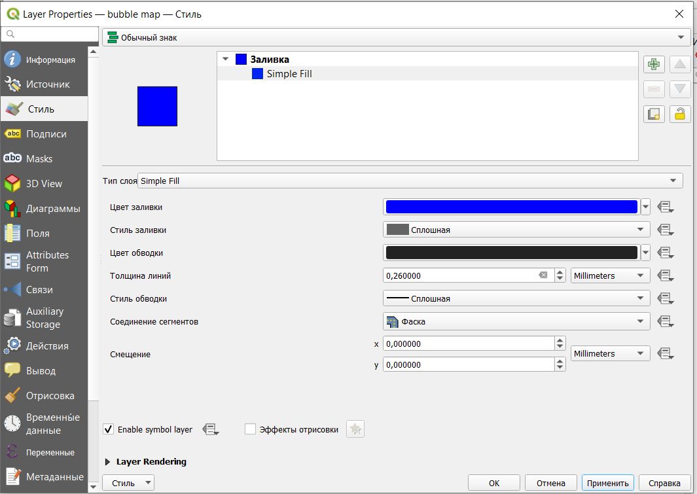
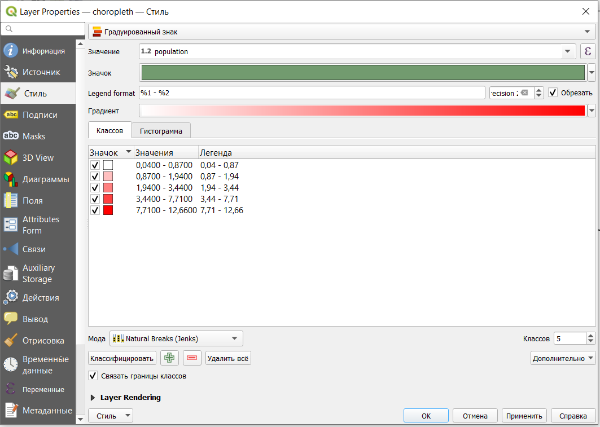
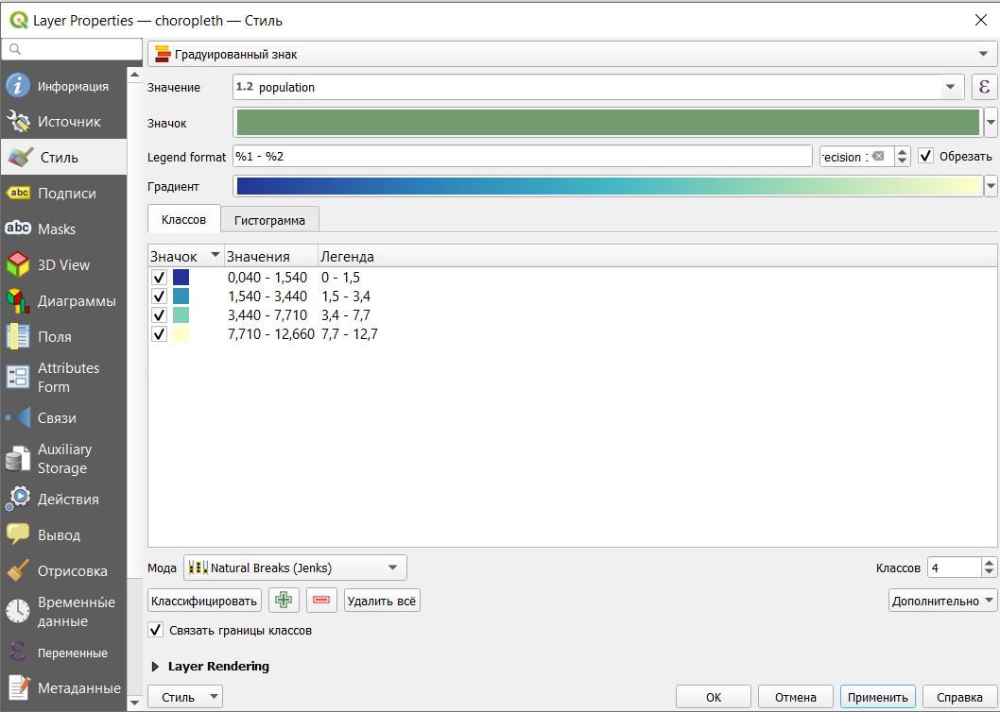
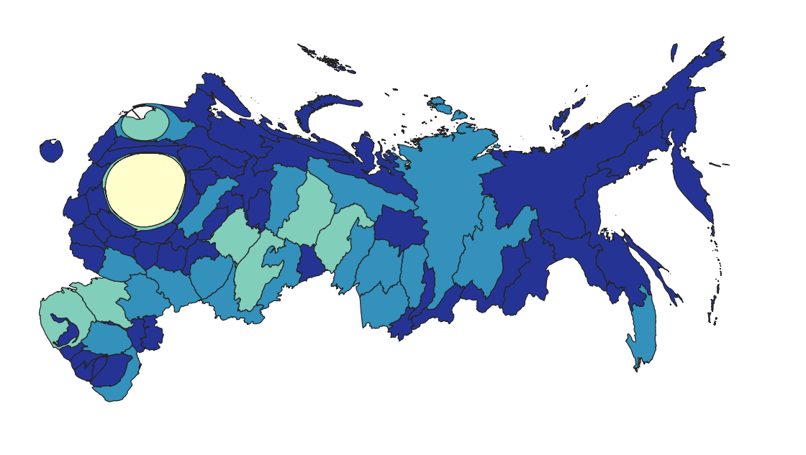

# Создание различных типов карт в QGIS {#visualisation-qgis}

## Исходные данные

В качестве исходных данных взяты границы регионов РФ с сайта <https://www.diva-gis.org/gdata>.

Исходный слой был перепроецирован в систему координат `Asia North Albers Equal Area Conic ESRI:102025` для минимизации искажений на карте. Также дополнительно были выполнены преобразования для того, чтобы Чукотка стала единым объектом.

В атрибутивную таблицу добавлены колонки с площадью субъектов и количеством населения (данные о населении по состоянию на 1 января 2021 года, [Росстат](https://rosstat.gov.ru/compendium/document/13282)).

Полученный слой можно скачать [здесь](https://drive.google.com/file/d/1smnWbvkk1qE4rv5p8QWo108MGqcylMJH/view?usp=sharing).

После открытия слоя в QGIS и перепроецирования на лету в систему координат `Asia North Albers Equal Area Conic ESRI:102025` (см. \@ref(add-object) и \@ref(reproject-fly)) он будет выглядет так

## Пропорциональные символы (bubble map)

Как уже обуждалось ранее, один из самых простых способов показать числовые значения - символы, размер которых пропорционален величине отображаемых значений.

### Способ 1 (через дополнительный слой знака)

Для того, чтобы создать такую карту нужно открыть свойства слоя (либо двойным кликом на название слоя, либо из контекстного меню Свойства).

В настоящий момент для слоя задана обычная заливка, которую нам нужно заменить на символы с настраиваемым размером. Для этого нужно нажать на 

После чего появится еще одна заливка в свойствах слоя.

Одну из этих заливок мы заменим на символы. Чтобы это сделать, нужно выбрать тип слоя **Centroid fill**.

Отметим, что нам нужно рамещать маркеры внутри полигона, но не нужно рисовать их на каждой части мультиполигона.

Далее проведем настройку непосредственно маркера. Чтобы открыть эти настройки, нужно щелкнуть на слова **Simple marker**.

Каждый символ может состоят из нескольких слоев символов **Symbol layers**.[^visualisation-qgis-1] Дерево символов показывает все эти слои и как они расположены относительно друг друга. Такие слои формируют новый комбинированный символ. Также здесь автоматически пересчитываются динамические показатели символов после изменения признаков.

[^visualisation-qgis-1]: The symbol layer tree <https://docs.qgis.org/3.16/en/docs/user_manual/style_library/symbol_selector.html#the-symbol-layer-tree>

Основные инструменты для управления деревом символов:

-    добавление нового слоя символа (можно добавлять сколько угодно слоев); t

-    удаление слоя;

-   блокировка цветов слоя символа  (заблокированные слои не меняются, даже если пользователь меняет настройки цвета глобально или на более высоком уровне иерархии);

-    дублировать слой символа или группу слоев;

-   свиг вверх или вниз по иерархии.

Мы хотим установить размер символа, чтобы он отражал число населения в регионе. Для этого напротив графы размер нужно нажать на кнопку и выбрать поле, по которому будет задаваться размер.

Чтобы карта была более читаема заливку в этом слое либо совсем убрать (как показано на картинке), либо сделать нейтральной и полупрозрачной.

Полученная карта

На карте видно, что в европейской части страны многие символы перекрывают друг друга, а в восточной Сибири и на Дальнем Востоке наборот символы очень малы.

Можно осуществить дальнейшую настройку символов, например, попробовать изменить размер, заменить цвет на более нейтральный и сделать символы полупрозрачными, чтобы можно было их различить при перекрывании точек.

### Способ 2 (через круговую диаграмму)

Также градуированные символы можно задать с использованием круговых диграмм.

Для этого нужно открыть свойства слоя на вкладке **Диаграммы** и выбрать тип круговую диаграмму (Pie chart), после чего задать переменную, по которой будут отрисовываться символы.

Далее настроим размер в зависимоти от величины населения.

Результат получается аналогичный результату в первом способе, но строится и загружается такая карта значительно медленнее.

## Картограмма (choropleth)

Так как данные в нашем случае представлены в виде полигонов, очевидный способ отображения - это картограмма.

Самый простой способ создания картограммы - открыть настройки стиля, выбрать тип символа **Градуированный знак**, поле, по значениям которого будет задаваться цвет полигонов и классифицировать значения.

В результате получим подобную карту.

Мы можем далее подкорректировать интервалы, подобрать градиент и прочие дополнительные настройки.

Но, как уже говорилось на прошлых занятиях, на подобных картах не рекомендуют использовать абсолютные значения, а нормализовывать их. В нашем случае карта как раз была построена по количеству населения, хотя предпочтительнее здесь будет отображать плотность населения.

Значение плотности населения мы можем рассчитать с помощью калькулятора полей и записать в новый столбец, а потом создать карту по этому новому показателю. Или же мы можем записать выражение прямо в настройках стиля нашего слоя.

Так как количество населения у нас было дано в миллионах человек, сначала это значение было домножено на 1 000 000, а потом поделено на значение площади в километрах квадратных. Таким образом мы получим плотность населения на 1 километр квадратный.

Соответственно у нас пересчитаются классы на основе новых значений.

На полученной карте видно, что классификация в нашем случае подобрана не удачно: много близких значений, поэтому большинство объектов раскрашены одним цветом.

Возможно в данном случае более подходящим методом классификации будут квантили (результат показан на картинке ниже) или ручное задание интервалов.

Для акцентирования внимания на границах и различиях между регионами можно выбрать тип символа **Shapeburst fill**. Этот тип символа создает градиент от границ полигонов к их центру.

## Карта плотности точек (dot density)

Карту плотности точек как и карту пропорциональных символов можно создать комбинацией слоев символов внутри настроек стиля.

Для этого к обычной заливке **Simple fill** нужно добавить дополнительный слой **Random marker fill**.

Количество точек в нашем случае нужно задать выражением.

Сделаем так, чтобы 1 точка была равно 100 000 человек. Количество населения в атрибутивной таблице было задано в миллионах, поэтому наши значения нужно просто умножить на 10.

Сразу же скорректируем размер маркера и цвет.

Полученная карта

> Важно помнить, что точки расставлены внутри полигонов случайным образом, то есть они не отображают реальное расположение населения.

## Анаморфная карта (cartogram)

В QGIS нет встроенного метода создания анаморфных карт, но это можно сделать с помощью плагина Cartogram. Как устанавливать плагины рассказано в \@ref(tiles).

После установки плагина на панели инструментов должен появиться значок 

В диалоговом окне создания анаморфной карты нужно указать:

-   для какого слоя она создается;

-   по какому показателю;

-   критерии остановки - количество итераций и максимальная ошибка (расчет прекращается, когда выполнено одно из условий).

## Карта с одновременным отображением двух переменных (bivariate map)

Построим карту, которая одновременно будет показывать величину субъектов (их площадь) и количество населения.

В этом разделе воспользуемся вот этим [туториалом](https://bnhr.xyz/2019/09/15/bivariate-choropleths-in-qgis.html) для QGIS, но есть и другие способы, например, от [Джошуа Стивенса](https://www.joshuastevens.net/cartography/make-a-bivariate-choropleth-map/).

Продублируем слой с субъектами РФ: один из них будет показывать население, другой - площадь. Впоследствии мы их наложим друг на друга, чтобы получить результирующую карту.

Настроим стиль слоя с населением. Здесь нам нужно задать 3 равных интервала с градиентом одного цвета.

Далее настроим стиль слоя с площадью аналогично предыдущему, но с градиентом другого цвета.

Далее для того слоя, который находится сверху ( в моем случае это слой со значениями площади) нужно изменить настройку режима смешивания.

В результате получим карту, показывающую одновременно две переменные.

Но подобные карты не понятны без легенды, поэтому создадим легенду карты с помощью плагина Bivariate legend (как установливать плагины рассказано в \@ref(tiles)).

Далее запустим плагин и создадим легенду нашей карты.

Созданная легенда экспортируется в виде картинки, которую мы можем добавить на макет карты для печати или публикации (про создание макетов см. \@ref(layout))

Оформим карту на макете.

> Полный проект с описанными типами отображения данных и настройками можно скачать [здесь](https://disk.yandex.ru/d/pCizYQb3fKXl4w)
