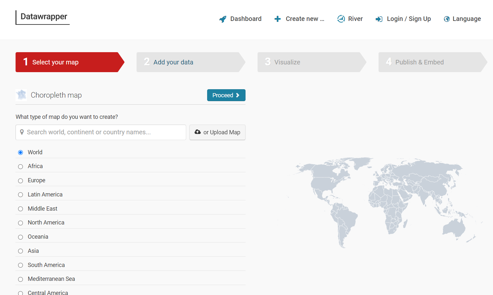
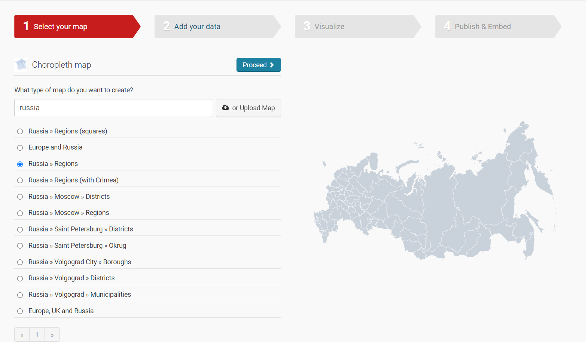
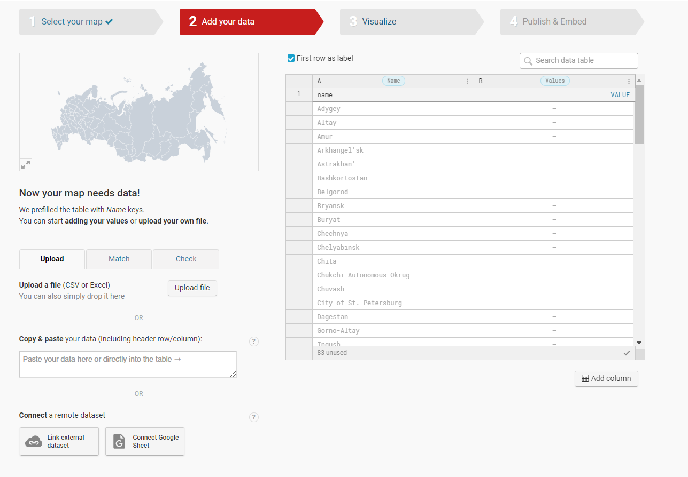
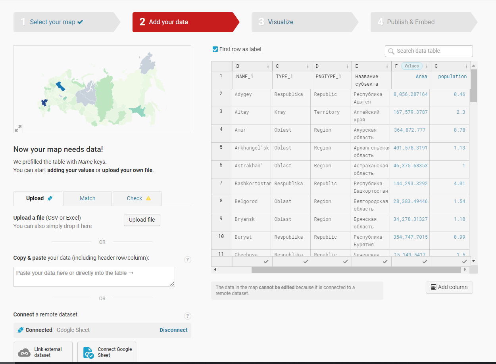
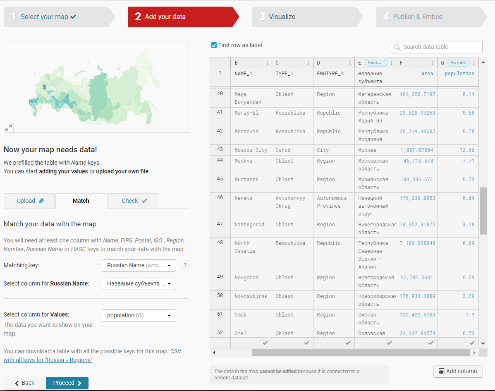
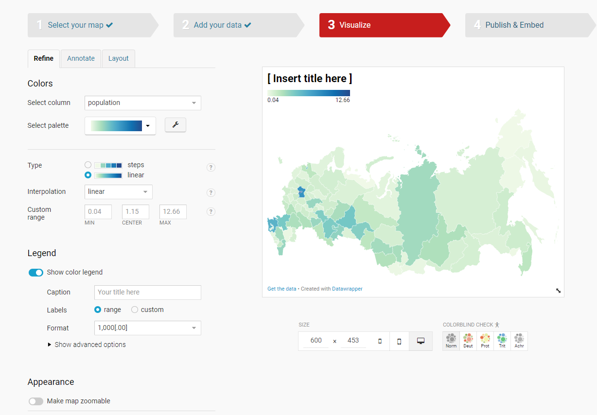
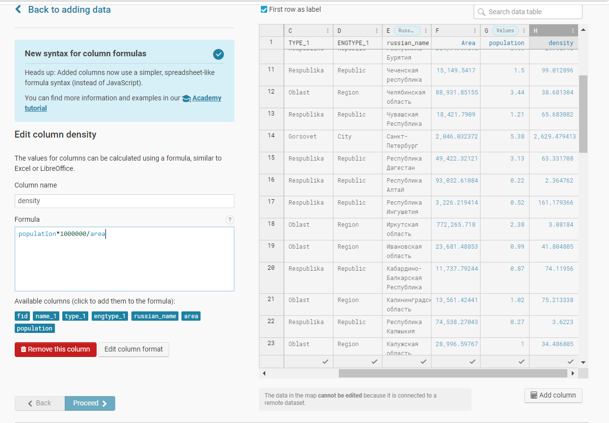
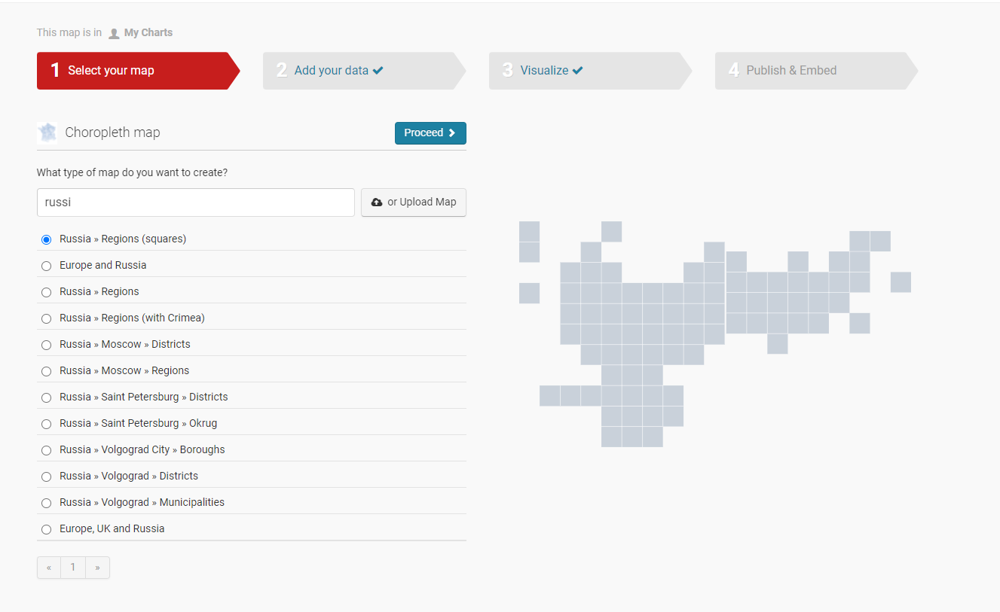

# Создание карт с помощью сервиса Datawrapper {#datawrapper}

Не всегда для подготовки и публикации карт может быть использовано специализированное ПО. С развитием сферы инфографики и визуализации данных некоторые сервисы предлагают возможность создания и подготовки карт прямо в браузере.

В ходе этого занятия мы воспользуемся сервисом Datawrapper <https://www.datawrapper.de/>, который позволяет создавать графики, таблицы и карты без регистрации в окне браузера.

Почитать про создание карт и особенности можно в блоге сервиса <https://blog.datawrapper.de/category/maps/> или в общей информации о картах <https://www.datawrapper.de/maps>

В качестве исходных данных, как и в предыдущий раз, воспользуемся данными о площади и населении субъектов РФ. Эти данные были сформированы в таблицу, находящуюся по ссылке <https://docs.google.com/spreadsheets/d/1sJ8Ea7n82EVIj2UVb_Uj6XYN9FwMfso60E4n-erqKic/edit?usp=sharing>

## Картограмма (choropleth) {#choropleth-datawrapper}

Для начала работы на странице <https://www.datawrapper.de/maps> нужно нажать кнопку **Build your own map**, которая переведет вас на страницу создания новой карты <https://app.datawrapper.de/select/map>.

В качестве первой карты создадим картограмму (choropleth). Выбираем соответствующий тип и переходим на страницу выбора территории нашей карты.

С помощью поиска нам нужно найти вариант **Russia » Regions**

Далее нам необходимо добавить данные для визуализации на карте. Так как в нашем случае исходные данные расположены в Google таблице, то мы можем подсоединиться к ней напрямую по ссылке **Connect Google Sheet.**

В результате справа появится таблица с нашими данными и на карте автоматически начнут раскрашиваться регионы.

Но здесь нужно совершить важный шаг: сопоставить шаблон карты с нашей таблицей. Их нужно объединить по общему полю с названиями регионов. Для этого нужно перейти во вкладку **Match** и выбрать общие колонки. Также на этом этапе нужно выбрать **Values**, то есть колонку со значениями, которые будут отображаться на карте (здесь выберем population - количество населения в регионе).

Далее мы можем заняться более подробной настройкой нашей карты

На этом этапе вы можете поменять цветовую шкалу, добавить источник данных, автора, описание, заголовок карты, заголовок легенды, возможности загрузки и прочие дополнительные элементы.

Полученную карту можно посмотреть по ссылке <https://datawrapper.dwcdn.net/eP32U/2/>

Но как вы возможно помните из предыдущих занятий на подобных картах не желательно отображать абсолютные значения. Поэтому отредактируем карту таким образом, чтобы она показывала плотность населения (чел/км кв).

Здесь вы можете продолжить работать с этой же картой, либо создать новую и добавить данные таким же образом, как и для предыдущей. Я просто продублировала карту, чтобы отредактировать ее копию.

В первую очередь нужно добавить новую колонку со значениями плотности населения. Рассчитываемую колонку мы можем добавить прямо в сервисе.

Также здесь нужно не забыть заменить колонку **Values**.

Далее мы можем настроить нашу карту по желанию.

Полученная карта населения по плотности доступна по ссылке <https://datawrapper.dwcdn.net/8VkjX/2/>

## Плиточная карта

Плиточную карту вы можете создать заново, а можете продулиблировать свою картограмму и просто отредактировать.

Плиточные карты в Datawrapper создаются аналогично картограммам, только в качестве типа карты выбирается **Russia » Regions (squares).**

В этом шаблоне карты русские названия регионов написаны немного не так. как в нашей таблице, поэтому автомитически привязки не случится у целого ряда субъектов.

Для исправления этого несоответствия есть два варианта:

1.  исправить названия в исходном датасете, чтобы они совпадали с названиями в шаблоне, и перезагрузить данные;

2.  отсоединить Google таблицу и найти соответствия в таблице вручную.

Остальной процесс создания и редактирования аналогичен \@ref(choropleth-datawrapper).

Полученную плиточную карту населения России можно посмотреть по ссылке <https://datawrapper.dwcdn.net/5n5b9/1/>
