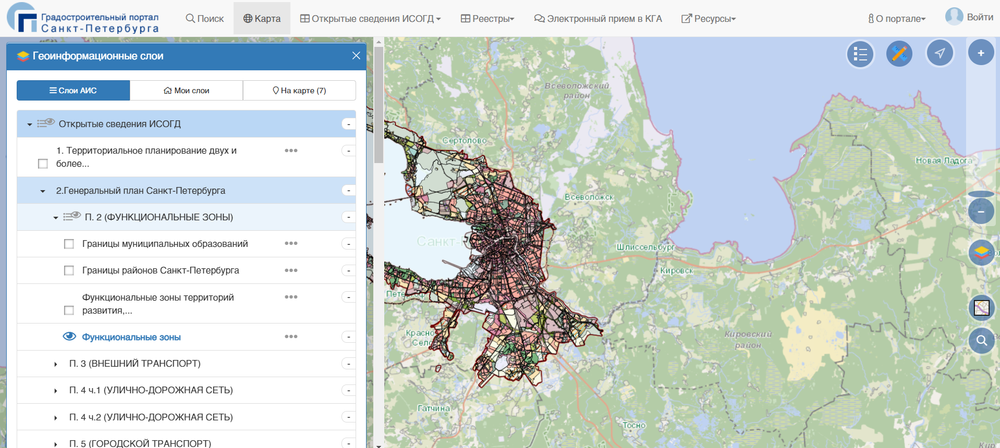
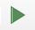
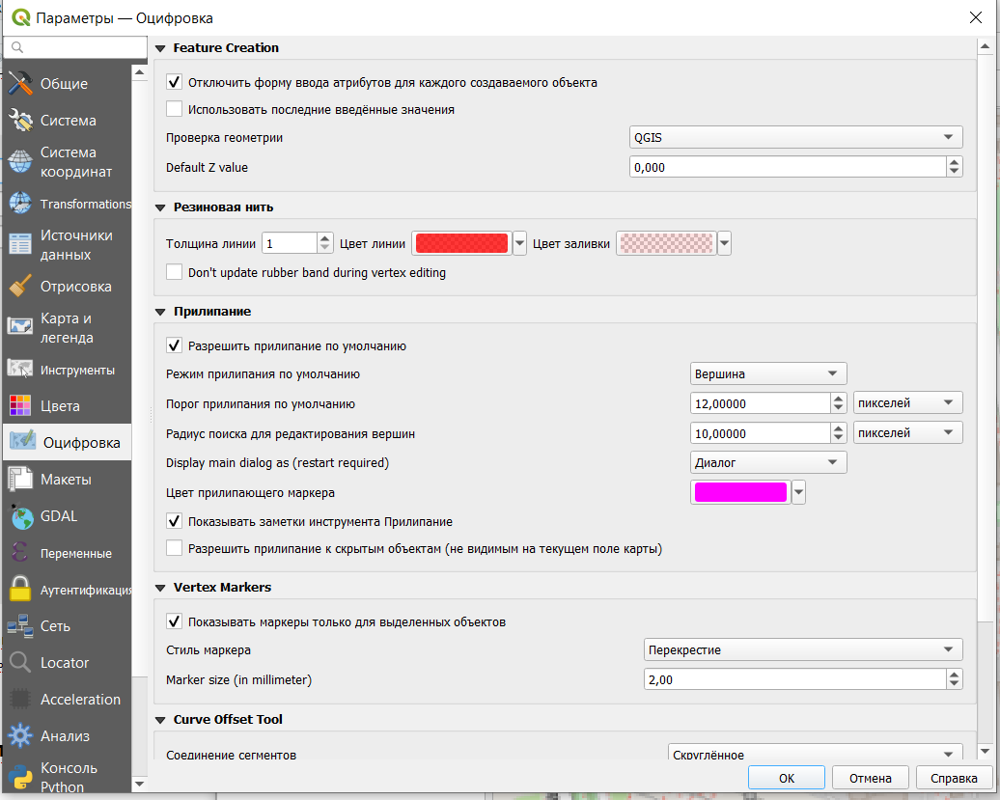
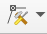

# Векторизация {#vectorisation}

**Векторизация** - процесс получения векторных географических данных. Как правило, имеется ввиду процесс получения на основе исходных растровых данных (сканированные карты, информация по официальным запросам, градостроительная документация и прочее).

## Геопривязка растра

В качестве исходной информации при векторизации, как правило, выступают растровые изображения. Это могут быть отсканированные оригиналы бумажных карт, выдержки из официальной документации, информация с градостроительных порталов, из градостроительной документации, спутниковые снимки или снимки, полученные с беспилотных летательных аппаратов, даже просто скриншоты экрана, а также тайловые подложки (типа той, что мы подгружаем из OpenStreetMap).

**Геопривязка растра** - это присвоение растровому изображению нужной географической системы координат.

В процессе привязки на растровом изображении для каждого пикселя, у которого есть условные координаты на растре, находится соотвествующая координата в целевой системе координат.

В качестве исходных данных возьмем информацию с Градостроительного портала Санкт-Петербурга <https://portal.kgainfo.spb.ru/KGAMap/Map>

Этот портал позволяет получать информацию из градостроительной документации Санкт-Петербурга, но только в растровом виде, выгрузки границ объектов в векторных форматах здесь не предусмотрено. Поэтому, если вы хотите воспользоваться данными портала, вам нужно будет из самостоятельно векторизовать.

Рассмотрим пример сохранения растровой картинки с границами функциональной зоны.

Для этого найдем на карте интересующую нас зону, щелкнем на нее, чтобы получить информацию об объектах в точке.

Далее выберем фунцию печати информации об функциональной зоне, после чего в новой вкладке откроется отчет с подробной информацией и схемой расположения объекта.

Просто сохраним картинку из отчета, чтобы в дальнейшем открыть ее в QGIS, выполнить геопривязку и осуществить векторизацию.

Создадим новый проект (рекомендую либо сразу его создавать в системе координат `EPSG:3857`, либо сразу после создания перепроецировать на лету в эту систему координат).

Для геопривязки растровых изображений в QGIS существует встроенный инструмент [**Georeferencer**](https://docs.qgis.org/3.22/en/docs/user_manual/working_with_raster/georeferencer.html) (может называться Геопривязка).

Далее откроется окно геопривязки растра.

В первую очередь нужно задать или проверить параметры трансформации растра (в строке меню *Параметры --- Параметры трансформации*).

Основные параметры здесь:

-   тип трансформации - алгоритм преобразования растрового изображения, подробнее [здесь](https://docs.qgis.org/3.22/en/docs/user_manual/working_with_raster/georeferencer.html?#available-transformation-algorithms);

-   метод интерполяции;

-   целевая система координат - система координат, которую вы хотите присвоить растру;

-   целевой растр - нужно указать путь и название файла, полученного в результате привязки.

Для выполнения привязки нужно открыть растр , указать контрольные точки и их координаты в целевой системе координат.

Контрольные точки - это точки, по которым будет осуществляться привязка растрового изображения. У этих точек известны координаты на растровом изображении (как правило, в пикселях) и в целевой системе координат, то есть фактически по этим точкам растр "усаживается" в нужное место на карту.

Чтобы поставить контрольную точку, нужно щелкнуть на нее в окне привзяки на растре, а далее указать ее координаты в диалоговом окне.

Координаты можно ввести с клавиатуры (если они у вас есть), либо выбрать вариант **С карты** и просто щеклнуть на ту же самую точку на карте, после чего эти координаты пропишутся в диалоговом окне автоматически.

В качестве контрольных точек лучше всего использовать какие-то жесткие контура, на которых вы однозначно можете указать конкретную точку: угол дома, перекресток, угол парка и что-нибудь подобное.

Для различных вариантов трансформации рекомендуется разное минимальное число контрольных точек, но, как правило, общая рекомендация использовать не менее 3 точек. Желательно, чтобы эти точки не были расположены на одной линии.

После того, как вы укажете все контрольные точки и их координаты на карте, они будут отображены в таблице под растровым изображением в окне привязки.

Контрольные точки привязки можно сохранить и потом использовать в дальнейшем в других проектах (но только для того же самого растра).

Для завершения процесса привязки нужно нажать **Начать привязку растра**  после чего растр будет модифицирован и отобразиться в нужном месте на карте.

Этот модифицированный растр уже будет иметь в себе сведения о системе координат и его местоположении, поэтому его потом можно будет использовать в дальнейших проектах уже без процесса привязки.

## Создание нового слоя и добавление в него объектов

Во всех предыдущих заданиях мы использовали уже готовые слои, которые просто добавляли в проект, но мы можем создавать и отрисовывать слои самостоятельно.

Для того, чтобы создать новый векторный слой в строке меню нужно выбрать **Файл - Создать слой - Создать новый Geopackage слой**.

После этого появится окно, в котором нужно задать имя файла, тип геометрии, систему координат, а также структуру таблицы атрибутов.

В качестве примера рассмотрим отрисовку домов, в атрибутивной таблице будут два поля: адрес и количество проживающих.

> Рекомендую все файлы и названия полей делать латиницей, потому что QGIS может не всегда корректно работать с данными, путь к которым прописан русскими буквами, а также с русскими названиями полей.
>
> Также следует помнить, что названия файлов и слоев, а также названия полей в атрибутивной таблице лучше делать осмысленными, чтобы вы потом могли понять, что содержится в ваших данных.

> Если вы не уверены в том, какие атрибуты вам нужны, то помните, что вы всегда можете отредактировать таблицу атрибутов уже после создания слоя и отрисовки объектов.

После того, как вы создадите слой, то он появится у вас в списке слоев, но, конечно, никаких объектов на карту не добавится, потому что они пока не отрисованы.

Для начала отрисовки объектов в слое необходимо включить режим редактирования.

После включения режима редактирования на панели инструментов станут активными кнопки создания объектов и редактирования вершин  (так как у нас слой с площадными объектами, то предлагается только создания полигонов и их редактирование, если бы был другой тип геометрии инструменты были бы немного другими).

Для начала отрисовки объекта нужно щелкнуть на первую точку полигона, а потом по всем поворотным, завершается отрисовка контура щелчком правой кнопкой мыши.

По умолчанию в программе стоит настройка открывать окно ввода атрибутов для каждого созданного объекта.

В этом окне можно ввести характеристики объектов сразу, либо оставить пустым, просто нажав кнопку ОК (если вы здесь нажмете кнопку Отмена, то объект не будет создан).

Автоматическое появление формы ввода можно отключить в настройках программы.

## Прилипание объектов

При отрисовке некоторых объектов важно, чтобы между ними были общие точки, общие границы, не было наложений или наоборот дырок между объектами. Для того, чтобы соблюдать эти правила, нужно пользоваться инструментами прилипания.

На панели инструментов прилипания доступны следующие функции (слева направо)

-   разрешить прилипание;

-   выбор слоев, для которых будет доступно прилипание: все слои - прилипание будет осуществляться с учетом объектов всех слоев, которые есть в проекте (даже невидимых в данный момент), активный слой - прилипание будет осуществляться только для объектов текущего слоя.

-   тип объектов, к которым осуществляется прилипание (может быть выбрано сразу несколько вариантов) 

    -   вершина - прилипание только к узловым точкам;

    -   сегмент - прилипание к любой точке линии;

    -   площадь - прилипание к любой точке внутри полигона;

    -   центроид - прилипание к геометрическому центру полигона;

    -   центр сегментов - прилипание только к середине линии.

-   порог прилипания - то есть, в какой области вокруг курсора будет искаться объект для прилипания;

-   топологическое редактирование позволяет сохранять общие границы между объектами. Если эта опция включена, то программа будет автоматически перестраивать общую границу для двух объектов (если таковая граница есть);

-   допустимы ли наложения между объектами 

-   разрешать прилипание к пересечениям - прилипание будет осуществляться к пересечениям двух объектов, даже если там нет вершины;

-   трассирование (tracing) - позволяет ускорить привязку к линейным объектам, при включении этой опции вам не нужно будет прощелкивать по всей линии, достаточно будет нескольких точек (если установаить значение отступа offset, то можно построить линию, параллельную существующей);

-   самоприлипание - позволяет осуществлять привязку отрисовываемого объекта к самому себе.

## Редактирование объектов

Для редактирования формы объектов следует пользоваться инструментом работы с вершинами 

Также для редактирования объектов есть целый ряд функций, представленных в пункте **Правка** строки меню.

### Перемещение объекта

### Поворот объекта

### Преобразование объекта в кольцо

### Разбивка объекта

