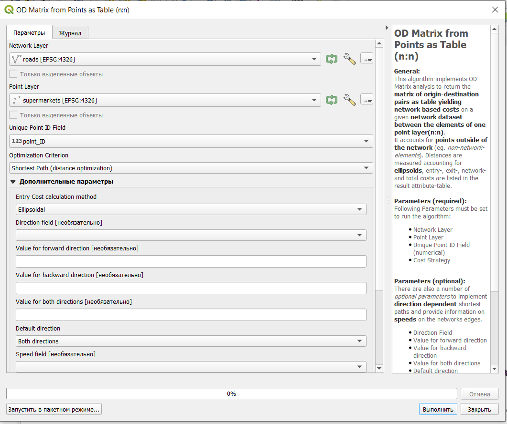

# Сетевой анализ {#network}

Сетевой анализ построен на [теории графов](https://ru.wikipedia.org/wiki/%D0%A2%D0%B5%D0%BE%D1%80%D0%B8%D1%8F_%D0%B3%D1%80%D0%B0%D1%84%D0%BE%D0%B2).

При использовании сетевого анализа улично-дорожная сеть рассматривается как набор узлов (перекрестков), которые соединены между собой ребрами (сегментами улиц или дорог между перекрестками). Передвижение по графу осуществляется только по ребрам, перемещение от ребра к ребру происходит через узлы.

Граф может быть направленным (если по нему можно передвигаться только в определенных направлениях) или ненаправленным (по графу можно передвигаться в любом направлении).

В ГИС сетевой анализ используется для решения двух основных задач: поиск кратчайшего пути и определение области обслуживания объекта.

С сетевым анализом так или иначе сталкивались практически все: каждый раз, когда вы строите свой маршрут в навигационном приложении, для вас осуществляется сетевой анализ с учетом целого ряда параметров (характеристики улично-дорожной сети, скорость передвижения, наличие ограничений в передвиженни, наличие пробок и прочие).

Для осуществления сетевого анализа существует большое число сервисов и плагинов, а также могут применяться [стандартные средства QGIS](https://docs.qgis.org/3.22/en/docs/user_manual/processing_algs/qgis/networkanalysis.html).

> Главный недостаток использования сторонних сервисов для задач сетевого анализа в том, что у вас нет конкретной информации о параметрах улично-дорожной сети, тогда как при использовании стандартных инструментов или инструментов, где вы сами задаете параметры сети, вы четко знаете как и каким образом осуществляется передвижение по исследуемой территории.

В качестве исходных данных для работы можно использовать скачанный с overpass-turbo.eu слой с улицами (городские и межрайонные магистрали), который лежит по [ссылке](https://drive.google.com/file/d/1mr0PbLWYntw37m7doOD5BFgPl8nZpIj3/view?usp=sharing) и слой с расположением супермаркетов, который доступен по [ссылке](https://drive.google.com/file/d/1LTFghQlrXeFDh5BI-hiZRBPbr6rzc7uw/view?usp=sharing) (как открыть табличные данные в QGIS описано в \@ref(add-object))

Либо можно самостоятельно скачать данные с overpass-turbo.eu (как это сделать было рассмотрено в \@ref(osm))

## Сетевой анализ стандартными средствами QGIS {#network-standart}

Для сетевого анализа в **Панели инструментов анализа** есть отдельный пункт.

Основные инструменты здесь - это **Область обслуживания** и **Поиск кратчайшего пути**.

### Область обслуживания

Доступно два варианта построения области обслуживания: от слоя (то есть от объектов точечного слоя) и от точки (то есть от одной заданной пользователем точки).

При построении области обслуживания от слоя самыми важными характеристиками являются:

-   слой, отображающий улично-дорожную сеть;

-   слой, содержащий точечные объекты, для которых строится область обслуживания (могут использоваться не все объекты слоя, а только выделенные);

-   travel cost - расстояние или время для определения области обслуживания. Расстояние задается, если выбран кратчайший путь, время (в часах), если выбран наиболее быстрый путь.

В качестве дополнительных параметров могут быть заданы:

-   поле направления - поле, в котором указано, в каком направлении можно передвигаться по определенному сегменту (в случае, если есть информация о том, какие улицы являются одно- или двухсторонними и в каком направлении по ним можно передвигаться);

-   значение для прямого направления, для обратного направления и для обоих направлений - какие значения в этом поле соответствуют каким направлениям;

-   направление по умолчанию - если граф является направленным и по нему можно передвигаться только в одном из направлений (по умолчанию по графу можно передвигаться в обоих направлениях);

-   поле скорости - поле, в котором указана скорость передвижения по конкретным сегментам сети;

-   скорость по умолчанию - скорость, с которой можно передвигаться по сети, если не задано поле скорости со значениями для каждого сегмента.

В результате выполнения могут быть получены два варианта результата: слой с линиями, в который входят сегменты сети, попадающие в область обслуживания, и слой с узлами, в который включаются все узлы сети, попадающие в область обслуживания и узлы, показывающие крайние точки области обслуживания (по умолчанию этот слой пропускается).

Область обслуживания для точки рассчитывается аналогично за исключением того, что вместо слоя нужно указать положение исходной точки. Это можно сделать введя ее координаты или просто указав на карте.

### Поиск кратчайшего пути

Поиск кратчайшего пути доступен в нескольких вариантах:

-   от слоя к точке - от объектов точечного слоя (могут использоваться только выделенные объекты) к заданной точке;

-   от точки к точке - поиск пути между заданными точками;

-   от точки к слою - от заданной точки к объектам точечного слоя (могут использоваться только выделенные объекты).

Параметры инструмента аналогичны параметрам области обслуживания, с некоторыми особенностями.

> Следует помнить, что при поиске кратчайшего пути не всегда существует путь между двумя точками.

В результате выполнения функции будет получен слой с линейными объектами, которые показывают найденные кратчайшие пути.

## Сетевой анализ с помощью плагина QNEAT3

Один из плагинов, который использует для сетевого анализа задаваемый пользователем граф улично-дорожной сети - это плагин **QNEAT3 - QGIS network analysis toolbox**. После установки плагина (как устанавливать плагины см. \@ref(tiles) он должен появиться в панели инструментов анализа.

Основные функции этого плагина:

-   построение матриц времени - origin-destination matrix;

-   построение изохрон в нескольких вариациях;

-   поиск кратчайшего пути между точками.

### Матрицы источник-назначение

> Матрица источник-назначение (origin-destination matrix) - это матрица, в которой исходные точки расположены рядами, а точки назначения столбцами, на пересечении которых указана стоимость передвижения между заданной парой точек. В качестве стоимости может быть использовано расстояние или время передвижения по улично-дорожной сети.

Матрицы источник-назначение можно строить либо между точками одного слоя, либо между точками разных слоев. Для их построения необходим слой с улично-дорожной сетью, по которой будет осуществляться передвижение, и слой с точечными объектами (или два слоя), между которыми будет осуществляться передвижение.

Матрицы источник-назначение могут быть созданы в виде линейных объектов, в виде таблицы или в виде csv файла.

Рассмотрим построение матрицы источник-назначение между объектами одного точечного слоя. В качестве улично-дорожной сети возьмем слой с улицами из предыдущего раздела \@ref(network-standart), а в качестве точечных объектов расположение супермаркетов из \@ref(add-object).

Так как для расчета матрицы для каждой точки нужен уникальный идентификатор, сначала создадим в слое с расположением супермаркетов новое поле, в которое запишем порядковые номера объектов.

Для этого нужно открыть таблицу атрибутов и запустить калькулятор полей, в котором создать новое поле и выбрать функцию **\$id** в окне создания выражения. Эта функция возвращает порядковый номер объекта в слое.

Далее запустим функцию **OD Matrix from Points as Table (n:n)**, в которой обязательными параметрами являются:

-   слой с улично-дорожной сетью;

-   слой с точечными объектами;

-   поле с идентификатором точечных объектов;

-   критерий оптимизации - кратчайшее расстояние или время.

Все остальные характеристики являются дополнительными и фактически аналогичны стандартным функциям, рассмотренным в предыдущем разделе \@ref(network-standart).

В результате расчета матрицы в виде таблицы будет получена только таблица атрибутов, в которой между всеми возможными парами точек будет рассчитано расстояние (или время) нужное на передвижение между этими точками.

> Следует отметить, что при расчете матриц источник-назначение определяется стоимость передвижения для всех пар точек, включая те, которые не попадают на улично-дорожную сеть (отсюда появляется стоимость входа и выхода к точкам).

При построении матрицы источник-назначение в виде csv-файла результат будет аналогичный, и он будет сразу записан в формат csv, удобный для дальнейшей работы и анализа.

В результате построения матрицы источник-назначение в виде линий будет получен новый линейный слой, соединяющий между собой все пары точек, каждой линии которого в качестве атрибутов будет прописано расстояние (или время) необходимые на передвижение между рассматриваемой парой.

Здесь для упрощения расчетов была выделена только часть слоя с точечными объектами.

### Построение изохрон

Построение изохрон в плагине QNEAT3 возможно в нескольких вариациях от одной точки или от объектов точечного слоя:

-   линии равного расстояния (равного времени);

-   поверхность интерполяции времени или расстояния;

-   облако точек с характеристиками времения или расстояния;

-   полигональные объекты.

Для корректной работы алгоритмов расчета изохрон в этом плагине рекомендуется применять только плоские прямоугольные системы координат (системы координат с единицами измерений в метрах), поэтому исходный слой улично-дорожной сети в нашем случае нужно перепроецировать в такую систему координат. Перепроецируем (см. \@ref(buffer) его в систему координат `EPSG: 32636`.

Дальнейшие расчеты изохрон следует уже делать с использованием перепроецированного слоя улично-дорожной сети.

Построение изохрон от одной точки и от объектов точечного слоя отличается только параметрами на входе и получаемым в результате количеством изохрон, поэтому далее будет рассмотрено построение изохрон от одной точки. Исходная точка может задаваться либо просто кликом на карте, либо ее можно задать по координатам.

При построении изохрон в виде линий равного расстояния или времени нужно задать:

-   слой улично-дорожной сети;

-   стартовую точку;

-   размер области, в пределах которой осуществляется расчет (расстояние или время в зависимости от критерия оптимизации);

-   интервал между линиями;

-   размер ячейки растра, получаемого в результате интерполяции;

-   критерий оптимизации

    -   кратчайшее расстояние - оптимизация по расстоянию, в этом случае размер области и интервала задается в единицах измерения системы координат слоя;

    -   наиболее быстрый путь - оптимизация по времени, в этом случае размер области и интервал задается в секундах.

Остальные параметры являются дополнительными и аналогичны рассмотренным выше.

Результатом расчета в этом случае будет являться два новых слоя: растр с результатами интерполяции и слой с контурами равного расстояния или времени (в зависимости от выбранного критерия оптимизации).

В центре полученного растра и контуров находится исходная точка.

Результирующий растр показывает более сглаженные промежуточные значения, которые получаются на основе интерполяции значений между контурами.

Такой же растр получается при расчета изохрон только в виде растровой поверхности (Iso-area as interpolation).

Построение изохрон как облака точек по параметрам аналогично рассмотреному выше построению в виде линий равного времени или расстояния с небольшими исключениями: здесь указывается только общий размер области, а также можно выбрать метод расчета расстояния (по эллипсоиду или на плоскости).

В результате получается слой, содержащий в себе все узлы улично-дорожной сети, каждому из которых присвоен атрибут расстояния (или времени в зависимости от параметра оптимизации).

Построение изохрон в виде полигональных объектов аналогично построению изохрон в виде линий равного времени/расстояния, только в результате вами будут получены не линейные объекты, а площадные со значениями времени или расстояния (в зависимости от выбранного критерия оптимизации).

В результате как и при построении изохрон в виде линий равного времени/расстояния получается два слоя: растровый слой с результатами интерполяции и векторный слой с полигональными объектами.

### Расчет кратчайшего пути между точками

Поиск кратчайшего расстояния с использованием плагина осуществляется только между двумя точками, которые можно указать на карте или задать по координатам.

В результате будет получен векторный слой с линией, соединяющей заданные точки старта и финиша.

Атрибутами этой линии будут являться характеристики перемещения между точками:

-   начальная точка и ее координаты;

-   конечная точка и ее координаты;

-   стоимость перемещения (расстояние) между точками.

