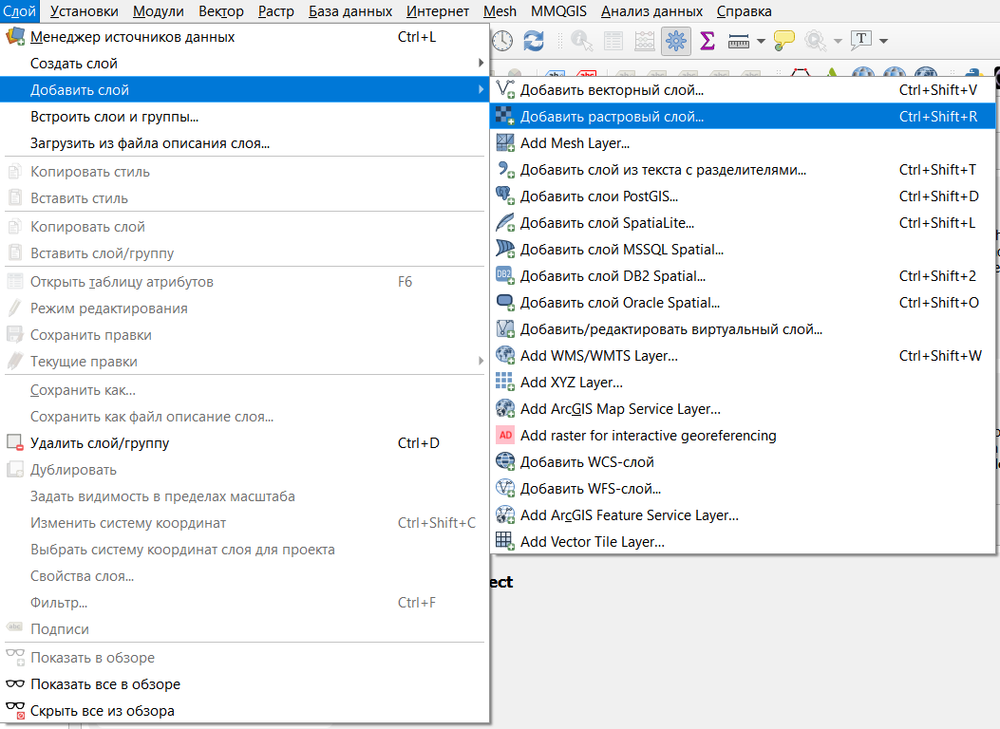
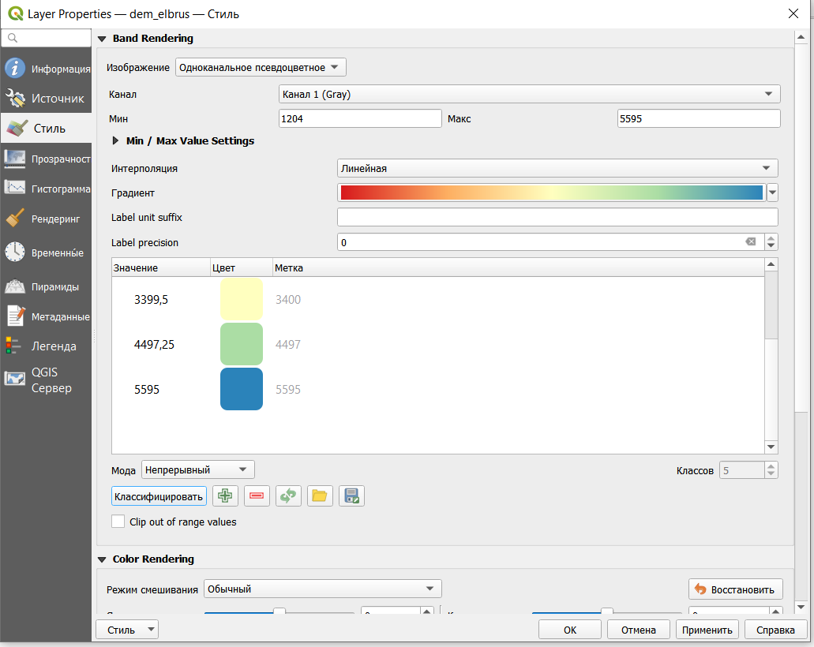
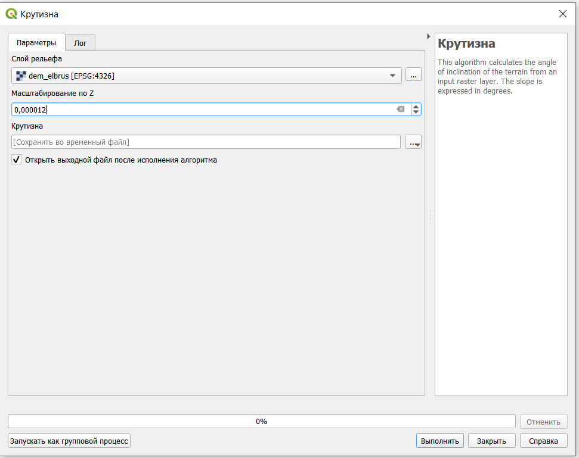
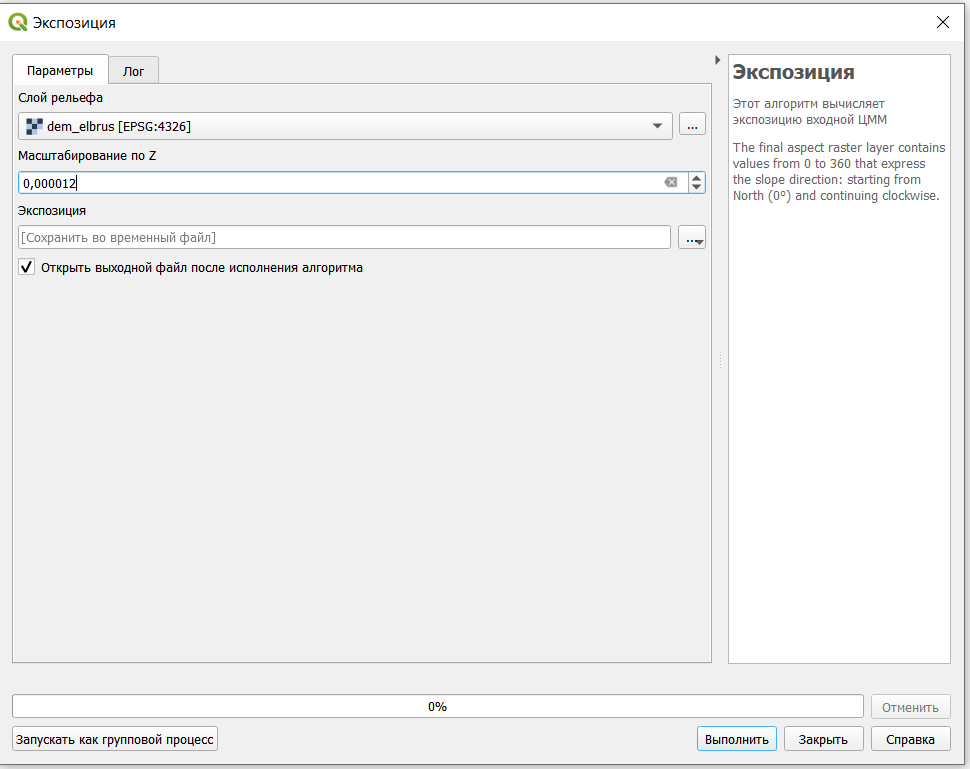
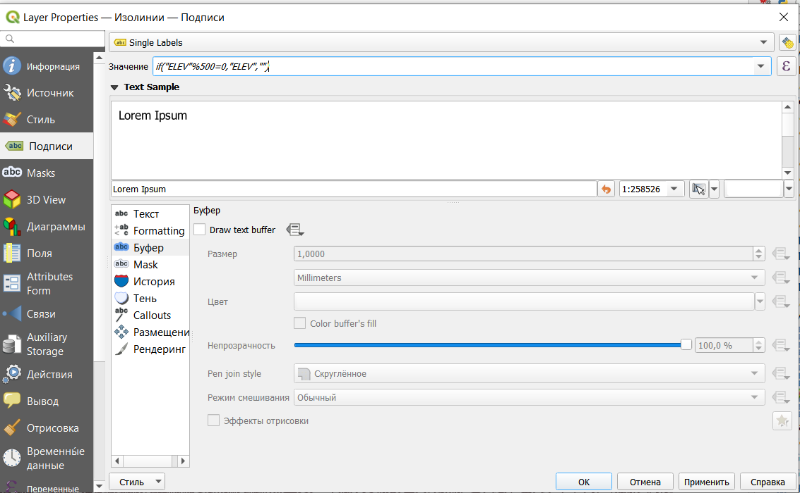
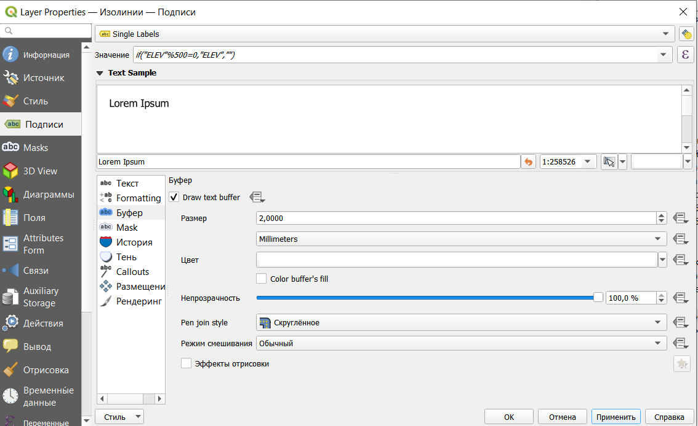
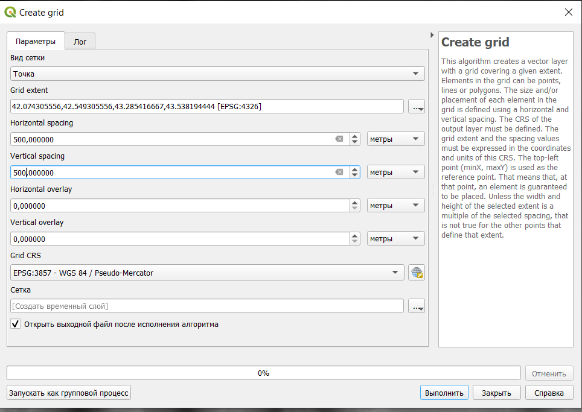

# Построение рельефа {#relief}

## Добавление цифровой модели рельефа

Цифровые модели рельефа, как правило, строят либо по результатам интерполяции, либо на основе открытых данных.

Самым распространенным источником данных о рельефе является цифровая модель рельефа SRTM (shuttle radar topographic mission). Эта цифровая модель была получена в 2000 году на основе спутниковой радарной съемки. Она охватывает планету между 54 градусами южной широты и 60 градусами северной широты. Подробнее на русском можно почитать про нее [здесь](https://gis-lab.info/qa/srtm.html)

Скачать данные SRTM можно на сайте Геологической службы США (<https://earthexplorer.usgs.gov/>) или с помощью плагина SRTM downloader.

Для примера и выполнения работы были скачаны данные для окрестностей Эльбруса (файл [dem_elbrus.tiff](https://drive.google.com/file/d/1FYFUxG7s_T-bEZV4Azu-G7FVfVIDZ86_/view?usp=sharing)).

Из SRTM выгружается сразу целая 1-градусная трапеция (фрагмент 1 градус по широте и 1 градус по долготе), в этом случае трапеция была обрезана до более маленького фрагмента (вообще не очень рекомендую работать с большими растрами, охватывающими сразу градус и более по долготе и широте).

В каждой ячейке исходного растрового изображения содержится значение высоты.

Добавление растрового слоя осуществляется через строку меню **Слой - Добавить слой - Добавить растровый слой**.

После открытия файла его лучше сразу перепроецировать на лету в EPSG:3857 (см. \@ref(reproject-fly)).

В результате будет открыто изображение рельефа в оттенках серого цвета.

Это изображение можно сделать цветным, для этого нужно открыть свойства слоя. В настройках стиля нужно выбрать тип изображения **Одноканальное псевдоцветное**.

Одноканальное здесь очевидно потому, что изображение не поделено на каналы и существует только в одном.

Градиент можно также создать самостоятельно с помощью редактора градиентов.

Или выбрать из готового каталога градиентов. Для этого при создании нового градиента нужно выбрать каталог **cpt-city**.

Далее в каталоге слева выбрать тип градиента Topography и подобрать нужный градиент (можно взять elevation или с3t3).

Также можно воспользоваться функцией Цветной рельеф, которая позволяет создавать классы автоматически и задавать им цвет.

С использованием такого растра может быть построена трехмерная поверхность, отображающая рельеф местности, а также выполнен ряд вычислений для морфометрического анализа рельефа.

Все растровые операции здесь осуществляются за счет разности значений между ячейками.

## Теневой рельеф[^relief-1]

[^relief-1]: <https://docs.qgis.org/3.16/en/docs/user_manual/processing_algs/qgis/rasterterrainanalysis.html?highlight=relief%20analysis#hillshade>

Для более наглядного отображения рельефа на карте рассчитывается теневой рельеф, который строится с использованием позиции источника направленного света, или теневая отмывка.

В данном случае одним из самых важных параметров является **Масштабирование по Z -** этот параметр позволяет соотнести между собой единицы измерения плановых координат и высот. В нашем случае высоты в ячейках растра приведены в метрах, а координаты - в градусах., кроме того, стоит учитывать, что в географических системах координат искажение зависит от долготы.

С этим можно справиться двумя способами - перепроецировать растра в прямоугольную систему координат или задать масштабирование по Z (Z-factor). Фактически с помощью этого коэффициента мы переходим от градусов к метрам. Так как у нас окрестности Эльбруса, то можно воспользоваться значением коэффициента для 40 градусов долготы - 0.00001171.[^relief-2]

[^relief-2]: <https://www.esri.com/arcgis-blog/products/product/imagery/setting-the-z-factor-parameter-correctly/>

Азимут и вертикальный угол задают положение источника света.

Этот теневой рельеф можно использовать, чтобы добавить дополнительный объем подложке (предварительно нужно добавить) или исходному рельефу растра. Для этого нужно открыть свойства слоя с теневым рельефом и изменить режим смешивания на Добавление, Осветление или Затемнение (также можно поэкспериментировать с настройками яркости и контрастности).

## Крутизна склонов[^relief-3]

[^relief-3]: <https://docs.qgis.org/3.16/en/docs/user_manual/processing_algs/qgis/rasterterrainanalysis.html?highlight=relief%20analysis#slope>

Рассчитаем крутизну склонов - угол наклона каждого склона в градусах.

## Экспозиция склонов[^relief-4]

[^relief-4]: <https://docs.qgis.org/3.16/en/docs/user_manual/processing_algs/qgis/rasterterrainanalysis.html?highlight=relief%20analysis#aspect>

Эта функция позволяет определить ориентацию склонов по сторонам света.

## Расчет неоднородности рельефа[^relief-5]

[^relief-5]: <https://docs.qgis.org/3.16/en/docs/user_manual/processing_algs/qgis/rasterterrainanalysis.html?highlight=relief%20analysis#ruggedness-index>

Также по растру с данными о рельефе может быть рассчитана неоднородность рельефа.

Этот показатель рассчитывается на основе разности значений между пикселями в сетке 3 на 3. Таким образом, каждый полученный пиксель содержит разницу между центральным пикселем и 8 его окружащими.

## Построение трехмерной поверхности

Также QGIS поддреживает отображение трехмерных поверхностей. Для этого нужно просто в строке меню выбрать **Вид - Новая 3D карта**.

После чего в окне программы появится окно трехмерной карты (перемещение по карте левой кнопкой мыши, поворот и наклон - колесико, приближение - правая кнопка мыши).

Сразу после открытия нового окна поверхность все еще является плоской, потому что не задано на основе чего строить трехмерную поверхность.

В окне трехмерной карты нужно нажать кнопку **Настройки** (в панели значков крайняя справа) и в открывшемся окне настроек выбрать тип **DEM (raster layer)**, **высота** (растровый слой с высотами) и **вертикальный масштаб** (здесь лучше всзять что-то от 1 до 5, чтобы поверхность была повыразительнее).

Дополнительно можно добавить **Terrain shading** (фактически теневая отмывка) и подкорректировать **tile resolution** (чем больше, тем более подробным будет рельеф), и **skirt height** (если правильно нашла - высота подставки под саму поверхность).

После чего в окне будет отображена трехмерная поверхность.

## Создание горизонталей

Из растра со значениями высот могут быть извлечены горизонтали

Расстояние между изолиниями - это фактически высота сечения рельефа, то есть через сколько мы будем проводить горизонтали.

Полученные изолинии

Настроим горизонтали таким образом, чтобы каждая пятая была утолщенной, добавим подписи и настроим их так, чтобы они были "головой вверх".

Начнем с настройки толщины линий. Для этого в свойствах слоя выберем настройку толщины в зависимости от выражения.

Далее пропишем логическое выражение: **if("ELEV"%500=0,0.7,0.3)**. В этом выражении перед запятой прописано условие - высота горизонтали делится на 500 без остатка, потом толщина линии, если условие выполняется, и толщина, если условие не выполняется.

Результат

Добавим подписи.

Но при таком добавлении подписей, будут подписаны все горизонтали, а мы хотим подписать только утолщенные. Для этого нужно прописать выражение, подобное тому, что мы писали выше: **if("ELEV"%500=0,"ELEV","").**

Добавим белую обводку подписям, чтобы они не сливались с горизонталями

Сделаем так, чтобы они размещались на линии и изгибались в соответствии с ней.

И настроим подписи так, чтобы все они смотрели головой в сторону увеличения высоты.

В результате получим горизонтали, где каждая пятая будет утолщена и подписана головой в сторону увеличения.

## Построение профиля местности

### Плагин ProfileTool

Продольный профиль можно построить с помощью плагина **Profile tool**.

Как установливать плагины описано в \@ref(tiles).

После установки плагин появится на панели инструментов 

При открытии плагина он откроется в виде новой панели внизу окна.

Работа здесь максимально простая: нужно выбрать слой, кликнув на него в списке слоев в основном окне, нажать **Add layer** в панели плагина, а потом просто нарисовать линию, по которой будет строится профиль на карте. Эта линия может быть прямой или ломаной. Точки поворота на ломаной ставятся одним кликом, заканчивается отрисовка линии профиля двойным кликом.

В настройках по умолчанию профиль строится по высотам, но может быть построен по крутизне склонов (в процентах или градусах).

Также профиль можно увеличивать и уменьшать, указывать минимальные и максимальные высоты.

Результат построения профиля можно сохранить просто как картинку, а можно сохранить в виде картинки или в виде полилинии в формате dxf, чтобы потом с ним можно было работать дальше (например, в AutoCAD).

### Средствами панели инструментов

Средствами QGIS из панели инструментов можно построить профили, но они уже не будут подробными графиками со значениями высоты и координатами.

Основано на вот [этом туториале](https://www.xyht.com/spatial-itgis/creating-album-covers-with-gis-or-drawing-elevation-as-vector-lines/) с некоторыми корректировками.

Для начала нужно построить сетку из точек (см. \@ref(grid)).

Здесь можно поэкспериментировать с параметрами сетки, чтобы получить немного разные по виду профили.

На самом деле эти точки - это центроиды ячеек заданного нами размера.

Далее точкам нужно присвоить значения высот из растра с помощью инструмента **Sample raster values**.

Полученный слой будет отличаться просто от сетки только таблицей атрибутов.

Далее точки нужно сместить на значение высоты, чтобы получить прдварительный контур профиля. Смещение точек нужно сделать инструментом **Перевести**.

Смещение нужно сделать по оси Y по значениям из колонки *SAMPLE_1* (в эту колонку по умолчанию у нас были записаны высоты из растра).

На последнем этапе точки нужно соединить линиями инструментом **Точки в путь**.

В этом случае Поле порядка - это то, в каком порядке точки будут соединяться (у нас это координата левого края ячейки сетки), а Поле группы - как наши точки будут объединены в группы, то есть у нас для каждой группы будет создана своя линия (в нашем случае - это координата верха ячейки сетки).

\

В результате будет получена подобная картинка.

\

В итоге получается что-то в стиле обложки [Joy division - Unknown pleasures.](https://ru.wikipedia.org/wiki/Unknown_Pleasures)

В этом варианте профили, конечно, получаются не очень информативные, потому что только визуально мы можем оценить без конкретных значений высот.
